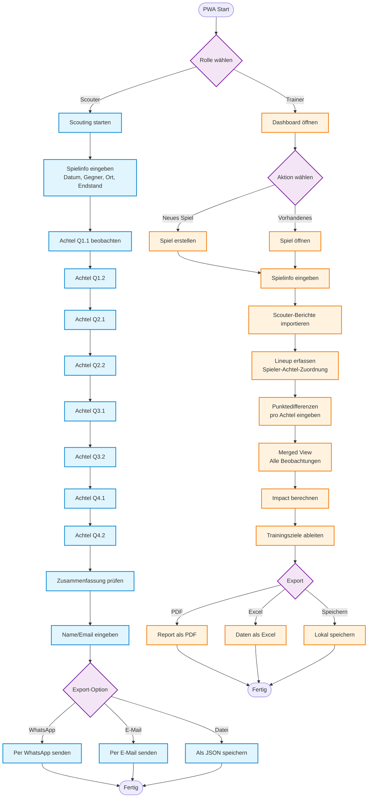
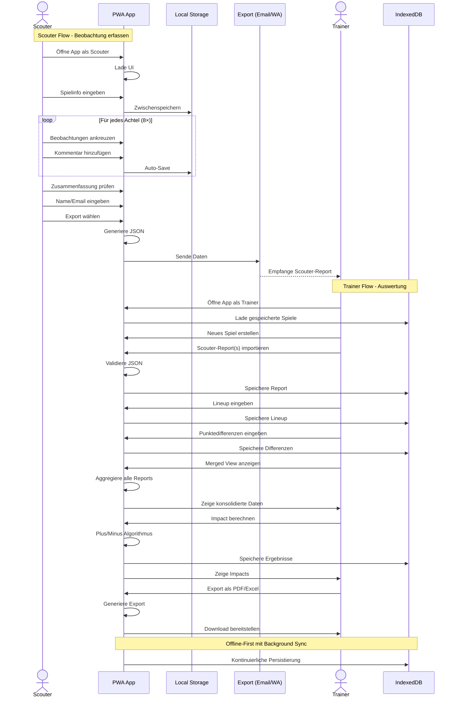
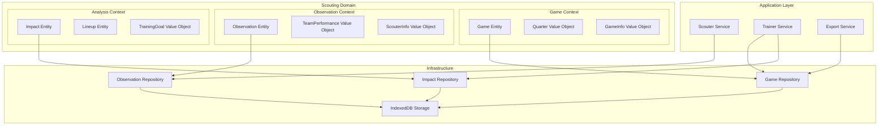

# Mini-Basketball Scouting PWA - Vollständige Spezifikation (React 19 + DDD)

## Projekt Übersicht

Eine Progressive Web App (PWA) für U10 Mini-Basketball Scouting mit zwei Benutzertypen: **Scouter** (Eltern/Helfer) für einfache Spielbeobachtung und **Trainer** für detaillierte Auswertung und Lineup-Analyse. Entwickelt mit **React 19**, **Domain-Driven Design** und aktuellsten Packages.

---

## 1. User Flow Diagram (Mermaid)



## 2. Sequence Diagram (Mermaid)



---

## 3. Domain-Driven Design Architektur

### 3.1 Bounded Contexts



### 3.2 Domain Model (TypeScript)

```typescript
// Domain Entities
export class Game {
  constructor(
    public readonly id: GameId,
    public readonly info: GameInfo,
    private _quarters: Quarter[],
    private _observations: Observation[] = []
  ) {}

  addObservation(observation: Observation): Game {
    const newObservations = [...this._observations, observation];
    return new Game(this.id, this.info, this._quarters, newObservations);
  }

  calculateImpact(lineup: Lineup): PlayerImpact[] {
    // Plus/Minus Berechnung basierend auf Lineup und Punktedifferenzen
    return this._quarters.map(quarter => 
      lineup.getPlayersForQuarter(quarter.id)
        .map(player => new PlayerImpact(player, quarter.pointDifference))
    ).flat();
  }

  get quarters(): readonly Quarter[] {
    return this._quarters;
  }

  get observations(): readonly Observation[] {
    return this._observations;
  }
}

// Value Objects
export class GameInfo {
  constructor(
    public readonly date: Date,
    public readonly opponent: string,
    public readonly venue: string,
    public readonly finalScore: Score
  ) {}

  static create(data: GameInfoData): GameInfo {
    return new GameInfo(
      new Date(data.date),
      data.opponent,
      data.venue,
      Score.fromString(data.finalScore)
    );
  }
}

export class Quarter {
  constructor(
    public readonly id: QuarterId,
    public readonly pointDifference: number
  ) {}
}

export class Observation {
  constructor(
    public readonly id: ObservationId,
    public readonly quarterId: QuarterId,
    public readonly teamPerformance: TeamPerformance,
    public readonly scouterInfo: ScouterInfo,
    public readonly comment: string,
    public readonly standoutPlayer?: string
  ) {}
}

// Aggregates
export class Lineup {
  constructor(
    private readonly playerAssignments: Map<QuarterId, PlayerId[]>
  ) {}

  assignPlayersToQuarter(quarterId: QuarterId, players: PlayerId[]): Lineup {
    const newAssignments = new Map(this.playerAssignments);
    newAssignments.set(quarterId, players);
    return new Lineup(newAssignments);
  }

  getPlayersForQuarter(quarterId: QuarterId): PlayerId[] {
    return this.playerAssignments.get(quarterId) || [];
  }
}
```

---

## 4. React 19 PWA Stack (2025)

### 4.1 Aktueller Tech Stack

```typescript
// package.json - Nur aktuelle Packages (2025)
{
  "dependencies": {
    "react": "^19.2.0",                    // React 19.2 mit neuen Features
    "@types/react": "^19.2.0",
    "react-dom": "^19.2.0",
    "@types/react-dom": "^19.2.0",
    
    // State & Effects (React 19 native)
    // useActionState, useFormStatus, useOptimistic sind built-in
    
    // Styling & UI
    "tailwindcss": "^3.4.0",              // Aktuellste Tailwind Version
    "@headlessui/react": "^2.1.0",        // Headless UI Components
    "clsx": "^2.1.0",                     // Conditional classes
    
    // Data & Storage
    "dexie": "^4.0.0",                    // IndexedDB wrapper
    "dexie-react-hooks": "^1.1.7",        // React hooks für Dexie
    
    // PWA & Service Worker
    "@vite-pwa/plugin": "^0.21.0",        // Vite PWA Plugin
    "workbox-window": "^7.1.0",           // Service Worker utilities
    
    // Validation & Types
    "zod": "^3.23.0",                     // Schema validation
    "type-fest": "^4.26.0",               // Utility types
    
    // Utils
    "nanoid": "^5.0.7",                   // ID generation
    "date-fns": "^3.6.0",                 // Date utilities
    "jspdf": "^2.5.1",                    // PDF generation
    "html2canvas": "^1.4.1"               // Canvas für PDF
  },
  "devDependencies": {
    "vite": "^6.0.0",                     // Vite 6.0
    "typescript": "^5.6.0",               // TypeScript 5.6
    "vitest": "^2.1.0",                   // Testing framework
    "@testing-library/react": "^16.0.0",   // React Testing Library
    "eslint": "^9.11.0",                  // ESLint v9
    "@typescript-eslint/eslint-plugin": "^8.7.0",
    "prettier": "^3.3.0"
  }
}
```

### 4.2 React 19 Features Integration

```typescript
// Nutze React 19 Actions API für Formulare
import { useActionState, useFormStatus } from 'react';

// Server Actions für Export (falls Backend vorhanden)
async function exportScoutingReport(formData: FormData) {
  'use server'
  
  const reportData = formData.get('reportData');
  // Export logic hier
}

// Scouter Form mit React 19 Features
export function ScouterForm() {
  const [state, formAction] = useActionState(
    async (prevState: any, formData: FormData) => {
      // Client-side action für lokales Speichern
      const gameData = Object.fromEntries(formData.entries());
      await saveToIndexedDB(gameData);
      return { success: true };
    },
    { success: false }
  );

  return (
    <form action={formAction}>
      <GameInfoInputs />
      <QuarterObservations />
      <SubmitButton />
    </form>
  );
}

function SubmitButton() {
  const { pending } = useFormStatus();
  
  return (
    <button 
      type="submit" 
      disabled={pending}
      className="btn-primary"
    >
      {pending ? 'Speichert...' : 'Beobachtung speichern'}
    </button>
  );
}

// React 19 use() Hook für Datenladung
import { use } from 'react';

function GamesList() {
  const games = use(gamesPromise);
  
  return (
    <div>
      {games.map(game => (
        <GameCard key={game.id} game={game} />
      ))}
    </div>
  );
}
```

### 4.3 DDD Projektstruktur

```
src/
├── domains/
│   ├── game/
│   │   ├── entities/
│   │   │   ├── Game.ts
│   │   │   └── Quarter.ts
│   │   ├── valueObjects/
│   │   │   ├── GameInfo.ts
│   │   │   ├── Score.ts
│   │   │   └── QuarterId.ts
│   │   ├── repositories/
│   │   │   ├── GameRepository.ts
│   │   │   └── GameRepositoryImpl.ts
│   │   └── services/
│   │       └── GameService.ts
│   │
│   ├── observation/
│   │   ├── entities/
│   │   │   └── Observation.ts
│   │   ├── valueObjects/
│   │   │   ├── TeamPerformance.ts
│   │   │   └── ScouterInfo.ts
│   │   ├── repositories/
│   │   │   └── ObservationRepository.ts
│   │   └── services/
│   │       └── ScoutingService.ts
│   │
│   └── analysis/
│       ├── entities/
│       │   ├── Impact.ts
│       │   └── Lineup.ts
│       ├── valueObjects/
│       │   ├── PlayerImpact.ts
│       │   └── TrainingGoal.ts
│       ├── repositories/
│       │   └── AnalysisRepository.ts
│       └── services/
│           └── AnalysisService.ts
│
├── infrastructure/
│   ├── storage/
│   │   ├── IndexedDBAdapter.ts
│   │   └── StorageService.ts
│   ├── export/
│   │   ├── PDFExporter.ts
│   │   └── JSONExporter.ts
│   └── pwa/
│       ├── serviceWorker.ts
│       └── cacheManager.ts
│
├── application/
│   ├── useCases/
│   │   ├── scouter/
│   │   │   ├── CreateObservationUseCase.ts
│   │   │   └── ExportObservationUseCase.ts
│   │   └── trainer/
│   │       ├── AnalyzeGameUseCase.ts
│   │       └── GenerateReportUseCase.ts
│   └── services/
│       ├── ScouterApplicationService.ts
│       └── TrainerApplicationService.ts
│
├── presentation/
│   ├── components/
│   │   ├── scouter/
│   │   │   ├── ScouterForm/
│   │   │   ├── QuarterObservation/
│   │   │   └── ExportOptions/
│   │   └── trainer/
│   │       ├── TrainerDashboard/
│   │       ├── GameEditor/
│   │       └── ImpactAnalysis/
│   ├── hooks/
│   │   ├── useScouting.ts
│   │   ├── useGameAnalysis.ts
│   │   └── useOfflineSync.ts
│   └── pages/
│       ├── ScouterPage.tsx
│       └── TrainerPage.tsx
│
└── shared/
    ├── types/
    │   ├── common.ts
    │   └── api.ts
    ├── utils/
    │   ├── validators.ts
    │   └── formatters.ts
    └── constants/
        └── app.ts
```

---

## 5. PWA Features mit React 19

### 5.1 Service Worker (Vite PWA Plugin)

```typescript
// vite.config.ts
import { VitePWA } from '@vite-pwa/plugin';

export default defineConfig({
  plugins: [
    react(),
    VitePWA({
      registerType: 'prompt',
      includeAssets: ['favicon.ico', 'apple-touch-icon.png'],
      manifest: {
        name: 'Mini Basketball Scouting',
        short_name: 'BasketScouting',
        description: 'Scouting App für U10 Mini-Basketball',
        theme_color: '#0288d1',
        background_color: '#ffffff',
        display: 'standalone',
        scope: '/',
        start_url: '/',
        icons: [
          {
            src: 'pwa-192x192.png',
            sizes: '192x192',
            type: 'image/png'
          },
          {
            src: 'pwa-512x512.png',
            sizes: '512x512',
            type: 'image/png'
          }
        ]
      },
      workbox: {
        runtimeCaching: [
          {
            urlPattern: /^https:\/\/api\./,
            handler: 'NetworkFirst',
            options: {
              cacheName: 'api-cache',
              expiration: {
                maxEntries: 100,
                maxAgeSeconds: 60 * 60 * 24 // 1 Tag
              }
            }
          }
        ]
      }
    })
  ]
});
```

### 5.2 Offline Storage mit Dexie

```typescript
// infrastructure/storage/IndexedDBAdapter.ts
import Dexie, { Table } from 'dexie';
import { Game, Observation } from '../domains';

interface GameRecord {
  id: string;
  data: Game;
  timestamp: number;
}

interface ObservationRecord {
  id: string;
  gameId: string;
  data: Observation;
  timestamp: number;
}

class ScoutingDatabase extends Dexie {
  games!: Table<GameRecord>;
  observations!: Table<ObservationRecord>;

  constructor() {
    super('ScoutingDatabase');
    
    this.version(1).stores({
      games: 'id, timestamp',
      observations: 'id, gameId, timestamp'
    });
  }
}

export const db = new ScoutingDatabase();
```

---

## 6. Implementierung - Aktualisierter Zeitplan

### 6.1 Phase 1 (MVP - 4 Wochen mit React 19)

**Woche 1:**
- Vite 6 + React 19.2 Setup
- DDD Projektstruktur anlegen
- Domain Entities & Value Objects implementieren

**Woche 2:**
- Scouter Flow mit useActionState
- IndexedDB Integration mit Dexie
- PWA Manifest & Service Worker

**Woche 3:**
- Trainer Dashboard
- Data Import/Export mit React 19 Actions
- Impact-Berechnung

**Woche 4:**
- Offline-Synchronisation
- Testing & Deployment
- Performance Optimierung

---

## 7. Fazit

Diese aktualisierte Spezifikation nutzt die **neuesten React 19 Features** wie Actions API, useActionState und built-in Optimierungen für eine moderne, performante PWA[web:81][web:84]. Die **Domain-Driven Design** Architektur sorgt für klare Trennung der Geschäftslogik und bessere Wartbarkeit[web:82][web:85].

**Key Benefits:**
- **React 19** Actions API eliminiert komplexe State Management
- **DDD** Struktur macht Code wartbarer und testbarer
- **Offline-First** PWA Ansatz für zuverlässige mobile Nutzung
- **TypeScript** Domain Models für typsichere Entwicklung

**Nächste Schritte:**
1. Repository Setup mit Vite 6 + React 19.2
2. Domain Models implementieren
3. MVP Development starten