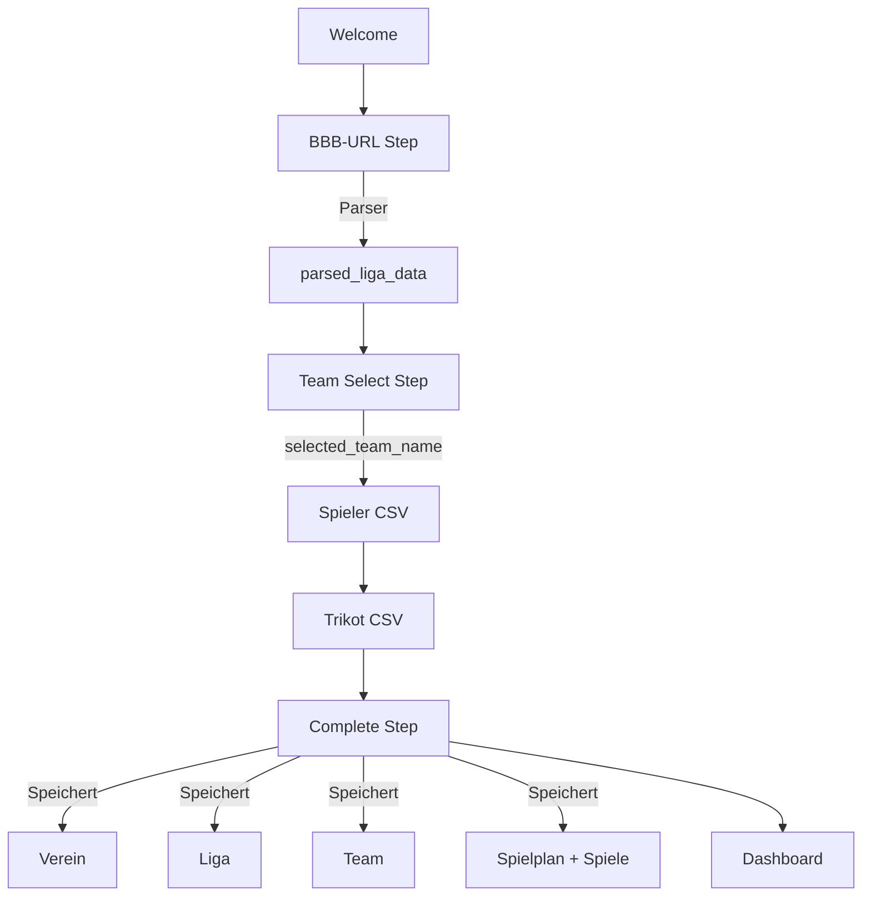

# 🔄 KORREKTUR: BBB-Import ist jetzt der Kern des Onboardings!

**Datum:** 11. Oktober 2025  
**Status:** ✅ Onboarding-Flow komplett überarbeitet

---

## 🎯 Was wurde korrigiert?

### Problem
Der ursprüngliche Onboarding-Flow hatte die **BBB-Integration am Ende (optional)** und erforderte **manuelle** Verein- und Team-Erstellung.

### Lösung
Der BBB-Import ist jetzt **SCHRITT 2** und das **zentrale Feature**! Alle Informationen werden **automatisch** aus der BBB-URL extrahiert.

---

## 🔄 Neuer Onboarding-Flow

### VORHER (❌ Falsch)
1. Welcome
2. Team manuell erstellen
3. Verein manuell erstellen
4. Spieler CSV
5. Trikot CSV
6. BBB-URL (optional)
7. Complete

### NACHHER (✅ Korrekt)
1. **Welcome** → Erklärt den Flow
2. **BBB-URL eingeben** → Parser läuft automatisch
3. **Team auswählen** → User wählt sein Team aus geparsten Daten
4. **Spieler CSV** → Import
5. **Trikot CSV** → Import
6. **Complete** → Alles wird automatisch gespeichert

---

## 🆕 Neue Komponenten

### 1. BBBParserService (`src/domains/bbb/services/BBBParserService.ts`)

**Funktionalität:**
- Extrahiert `liga_id` aus jeder BBB-URL (Spielplan, Tabelle oder Ergebnisse)
- Generiert alle 3 URLs automatisch
- Parst HTML und extrahiert:
  - Liga-Informationen (Name, Saison, Altersklasse, Region)
  - Alle Teams mit Vereins-Zuordnung
  - Vollständiger Spielplan mit allen Spielen

**CORS-Problem:**
- Development: Mock-Daten
- Production: CORS-Proxy nötig (z.B. allorigins.win)

**Beispiel:**
```typescript
const result = await bbbParserService.parseLigaFromUrl(
  'https://www.basketball-bund.net/public/spielplan_list.jsp?liga_id=51961'
);

// Ergebnis:
{
  liga: { liga_id, liga_name, saison, altersklasse, region },
  teams: [{ team_name, verein_name, verein_ort }],
  spiele: [{ spielnr, datum, heim_team, gast_team, ... }],
  spielplan_url, tabelle_url, ergebnisse_url
}
```

---

### 2. BBBUrlStep (`src/domains/onboarding/components/BBBUrlStep.tsx`)

**Schritt 2 des Onboardings**

- User gibt BBB-URL ein (Spielplan, Tabelle oder Ergebnisse)
- Parser extrahiert automatisch Liga-Daten
- Zeigt Erfolgs-Meldung mit gefundenen Teams/Spielen
- Speichert parsed_liga_data im Store

**Hinweise für User:**
- Funktioniert mit allen drei URL-Typen
- Beispiel-URL anzeigbar
- Dev-Mode-Hinweis

---

### 3. TeamSelectStep (`src/domains/onboarding/components/TeamSelectStep.tsx`)

**Schritt 3 des Onboardings**

- Zeigt alle geparsten Teams als auswählbare Buttons
- User wählt sein Team (welches trainierst du?)
- Eingabe des Trainer-Namens
- Zeigt Verein und Ort zu jedem Team

**Info:**
- Verein, Liga und Spielplan werden automatisch gespeichert

---

## 🔄 Aktualisierte Komponenten

### 1. onboardingStore.ts
**Neu:**
```typescript
- bbb_url: string
- parsed_liga_data: BBBParseResult
- selected_team_name: string
- trainer_name: string
```

**Entfernt:**
```typescript
- team: Partial<Team>
- verein: Partial<Verein>
- spielplan optional
```

### 2. WelcomeStep.tsx
- Beschreibt neuen BBB-basierten Flow
- Erwartungshaltung: Liga importieren → Team wählen

### 3. CompleteStep.tsx
**Jetzt viel komplexer! Speichert automatisch:**
1. Verein (aus geparsten Daten)
2. Liga (aus geparsten Daten)
3. Team (mit Verweis auf Verein + Liga)
4. Spielplan (mit BBB-URLs)
5. Alle Spiele (aus geparsten Daten)
6. Liga-Teilnahmen für alle Teams

**Progress-Anzeige:**
- Zeigt aktuellen Schritt
- Loading-Animation
- Fehlerbehandlung

### 4. SpielerImportStep.tsx & TrikotImportStep.tsx
- Zurück-Buttons angepasst
- Zeigen selected_team_name
- Validierung statt direktem Import (Import erfolgt bei Complete)

### 5. OnboardingLayout.tsx
- Neuer Progress-Indicator mit 6 Steps
- Labels aktualisiert

### 6. OnboardingContainer.tsx
- Routing für neue Steps

---

## 🗑️ Entfernte Komponenten (nicht mehr benötigt)

- ❌ `TeamStep.tsx` → Ersetzt durch TeamSelectStep
- ❌ `VereinStep.tsx` → Automatisch aus BBB
- ❌ `SpielplanStep.tsx` → Jetzt am Anfang (BBBUrlStep)

---

## 📊 Datenfluss



---

## 🎯 Was wird automatisch importiert?

Aus **einer einzigen BBB-URL** werden extrahiert:

### Liga-Informationen
- Liga-Name (z.B. "U10 mixed Oberpfalz Bezirksliga")
- Saison (z.B. "2025/2026")
- Altersklasse (z.B. "U10")
- Region (z.B. "Oberpfalz")
- Spielklasse (z.B. "Bezirksliga")

### Vereine
- Alle Vereine der Liga
- Ort (wenn verfügbar)
- Automatische Zuordnung zu Teams

### Teams
- Alle Teams der Liga
- Team-Namen (z.B. "DJK Neustadt 1")
- Vereins-Zuordnung

### Spielplan
- Alle Spiele mit Datum, Uhrzeit
- Heim/Gast-Zuordnung
- Spielnummer (für Sync)
- Spieltag
- Halle (wenn verfügbar)

### BBB-URLs
- Spielplan-URL
- Tabellen-URL
- Ergebnisse-URL
- Automatisch generiert aus einer Liga-ID

---

## ✅ Vorteile des neuen Flows

1. **Weniger manuelle Eingaben**
   - Kein manuelles Vereins-Erstellen
   - Kein manuelles Team-Erstellen
   - Spielplan automatisch

2. **Fehlerfreier**
   - Team-Namen exakt wie in BBB
   - Vereine automatisch korrekt zugeordnet
   - Alle Spiele mit korrekten Daten

3. **Schneller**
   - Nur 1 URL eingeben statt viele Formular-Felder
   - 3-5 Minuten statt 10 Minuten

4. **Synchronisierbar**
   - BBB-URLs gespeichert für späteren Auto-Sync
   - Liga-ID für Updates
   - Spielnummer für Matching

---

## 🚧 Bekannte Einschränkungen

### CORS-Problem
**Problem:** BBB erlaubt kein Cross-Origin Fetching im Browser

**Lösung:**
- **Development:** Mock-Daten (Demo-Liga mit 4 Teams)
- **Production:** CORS-Proxy nötig:
  - Option 1: Eigener Proxy-Server
  - Option 2: Public Proxy (allorigins.win)
  - Option 3: Browser-Extension

### HTML-Parsing
**Problem:** BBB-HTML-Struktur kann sich ändern

**Lösung:**
- Robuste Parser-Logik mit Fallbacks
- Fehlerbehandlung für unerwartete Strukturen
- Manueller Import als Fallback möglich

---

## 🧪 Testing

### Was getestet werden muss:
- [ ] BBBParserService Unit Tests
  - extractLigaId()
  - buildUrls()
  - parseSpielplanHtml()
  - parseLigaName()
  - parseTeamsFromTable()
  - parseSpieleFromTable()

- [ ] Onboarding Integration Tests
  - BBB-URL → Parsed Data
  - Team-Auswahl → Store
  - Complete → DB-Speicherung

- [ ] E2E Tests
  - Kompletter Onboarding-Flow
  - BBB-Import mit echten URLs

---

## 📦 Neue Dependencies

Keine! Alle Parsing-Funktionen nutzen native Browser-APIs:
- `URL()` für URL-Parsing
- `DOMParser()` für HTML-Parsing
- `fetch()` für HTTP-Requests

---

## 🚀 Nächste Schritte

### Kurzfristig (MVP)
1. ✅ BBB-Parser implementiert
2. ✅ Onboarding-Flow korrigiert
3. ⏳ CORS-Proxy für Production
4. ⏳ BBBParserService Tests

### Mittelfristig
1. Auto-Sync bei App-Start
2. Liga-Tabellen-Import
3. Ergebnisse-Import
4. Benchmark-Analysen

---

## 📝 Migration für bestehende Instanzen

**Wenn jemand die alte Version bereits verwendet:**

1. Onboarding-State löschen (localStorage)
2. Neu durchlaufen mit BBB-URL
3. Spieler/Trikots neu importieren

**Code:**
```javascript
localStorage.removeItem('basketball-onboarding');
window.location.reload();
```

---

## 🎉 Zusammenfassung

Der Onboarding-Flow wurde **fundamental überarbeitet**:

✅ **BBB-Import ist jetzt zentral** (nicht optional)  
✅ **Automatische Extraktion** von Liga, Vereinen, Teams, Spielplan  
✅ **Weniger manuelle Eingaben** (nur Team auswählen + Trainer-Name)  
✅ **Fehlerfreier** (exakte BBB-Daten)  
✅ **Synchronisierbar** (URLs + IDs gespeichert)  

**Die App ist jetzt wie dokumentiert!** 🏀

---

**Implementiert:** 11. Oktober 2025  
**Dateien geändert:** 15  
**Neue Dateien:** 3  
**Gelöscht:** 3 (alte Onboarding-Steps)
