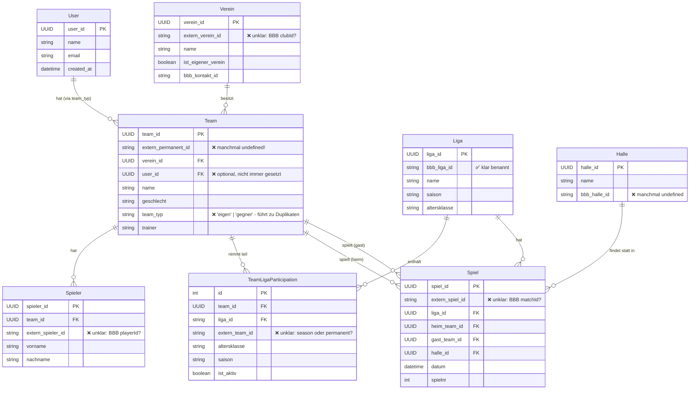
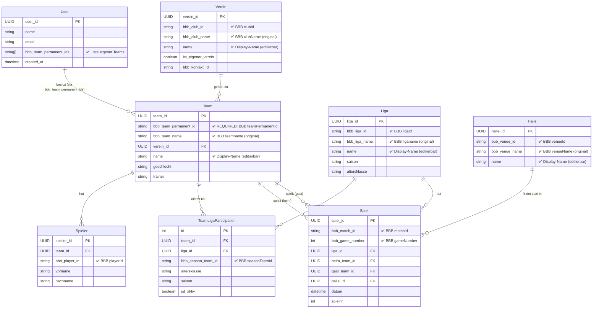

# DB v10 Migration Plan - BBB-konformes Schema

**Version:** 10.0  
**Status:** 🟡 PLANUNG  
**Erstellt:** 2025-11-04  
**Letztes Update:** 2025-11-04  

---

## 📋 Executive Summary

### Ziel
Migration von DB v9 zu v10 mit folgenden Hauptzielen:
1. **BBB-API-konformes Naming** mit `bbb_` Prefix für alle externen Felder
2. **User-zentrische Architektur** - Team-Ownership über `User.bbb_team_permanent_ids[]`
3. **Eliminierung von `team_typ`** - Ownership über User-Liste statt Flag
4. **Deduplizierung** über `bbb_team_permanent_id` garantiert
5. **Multi-Team Support** out-of-the-box

### Motivation
**Aktuelle Probleme (v9):**
- ❌ Field-Namen inkonsistent mit BBB-API (`extern_team_id` vs. `teamPermanentId`)
- ❌ `team_typ: 'eigen' | 'gegner'` führt zu Duplikaten
- ❌ Keine klare Single-Source-of-Truth für Team-Ownership
- ❌ Multi-Team Support kompliziert
- ❌ BBB-Import-Code schwer zu verstehen (Mapping unklar)

**Erwartete Verbesserungen:**
- ✅ 1:1 API-Mapping → kein Rätselraten mehr
- ✅ User-Liste = Single-Source-of-Truth
- ✅ Automatische Deduplizierung
- ✅ Einfacherer Multi-Team Support
- ✅ Klarerer Code

### Breaking Changes
- ⚠️ **BREAKING:** Schema-Änderungen in `teams`, `vereine`, `ligen`, `spiele`, `hallen`
- ⚠️ **BREAKING:** `team_typ` wird entfernt
- ⚠️ **BREAKING:** `User.bbb_team_permanent_ids` wird benötigt
- ⚠️ **BREAKING:** Alle Services müssen angepasst werden

---

## 🏗️ Aktuelle Architektur (v9)

### Entity Relationship Diagram (v9)



### Probleme v9

| Problem | Auswirkung | Häufigkeit |
|---------|------------|------------|
| **Unklare Field-Namen** | Developer muss raten welches BBB-Feld gemeint ist | 🔴 Ständig |
| **`team_typ` Duplikate** | Teams werden dupliziert statt wiederverwendet | 🔴 Kritisch |
| **`extern_permanent_id` optional** | Team-Deduplizierung schlägt fehl | 🔴 Kritisch |
| **Keine User-Team-Liste** | Multi-Team Support kompliziert | 🟡 Mittel |
| **Bidirektionale Sync** | `user_id` + `team_typ` müssen synchron sein | 🟡 Mittel |

---

## 🎯 Ziel-Architektur (v10)

### Entity Relationship Diagram (v10)



### Verbesserungen v10

| Verbesserung | Vorteil | Priorität |
|--------------|---------|-----------|
| **`bbb_` Prefix** | 1:1 API-Mapping, kein Rätselraten | 🔴 Hoch |
| **`bbb_team_permanent_id` REQUIRED** | Garantierte Deduplizierung | 🔴 Hoch |
| **`User.bbb_team_permanent_ids[]`** | Single-Source-of-Truth für Ownership | 🔴 Hoch |
| **Kein `team_typ`** | Keine Duplikate mehr | 🔴 Hoch |
| **Original + Display-Name** | BBB-Daten unveränderbar, User kann umbenennen | 🟡 Mittel |

---

## 🔄 Field Mapping (v9 → v10)

### User

| v9 Field | v10 Field | Type | Migration |
|----------|-----------|------|-----------|
| `user_id` | `user_id` | UUID | ✅ Keine Änderung |
| `name` | `name` | string | ✅ Keine Änderung |
| `email` | `email` | string? | ✅ Keine Änderung |
| `created_at` | `created_at` | Date | ✅ Keine Änderung |
| - | `bbb_team_permanent_ids` | string[] | 🆕 Ermittle aus `teams.team_typ='eigen'` |

**Migration Logic:**
```typescript
// Finde alle eigenen Teams mit permanent_id
const myTeams = await tx.table('teams')
  .where('team_typ').equals('eigen')
  .filter(t => !!t.extern_permanent_id)
  .toArray();

user.bbb_team_permanent_ids = myTeams.map(t => t.extern_permanent_id);
```

---

### Verein

| v9 Field | v10 Field | BBB API Field | Migration |
|----------|-----------|---------------|-----------|
| `verein_id` | `verein_id` | - | ✅ Keine Änderung |
| `extern_verein_id` | `bbb_club_id` | `clubId` | 🔄 Rename |
| - | `bbb_club_name` | `clubName` | 🆕 Aus `name` kopieren |
| `name` | `name` | - | ✅ Bleibt (editierbar) |
| `ist_eigener_verein` | `ist_eigener_verein` | - | ✅ Keine Änderung |
| `bbb_kontakt_id` | `bbb_kontakt_id` | - | ✅ Keine Änderung |

**Migration Logic:**
```typescript
verein.bbb_club_id = verein.extern_verein_id;
verein.bbb_club_name = verein.name; // Original-Name
delete verein.extern_verein_id;
```

---

### Team

| v9 Field | v10 Field | BBB API Field | Migration |
|----------|-----------|---------------|-----------|
| `team_id` | `team_id` | - | ✅ Keine Änderung |
| `extern_permanent_id` | `bbb_team_permanent_id` | `teamPermanentId` | 🔄 Rename + REQUIRED |
| - | `bbb_team_name` | `teamname` | 🆕 Aus `name` kopieren |
| `verein_id` | `verein_id` | - | ✅ Keine Änderung |
| `name` | `name` | - | ✅ Bleibt (editierbar) |
| `geschlecht` | `geschlecht` | - | ✅ Keine Änderung |
| `trainer` | `trainer` | - | ✅ Keine Änderung |
| `team_typ` | ❌ ENTFERNT | - | 🗑️ Ersetzt durch User-Liste |
| `user_id` | ❌ ENTFERNT | - | 🗑️ Ersetzt durch User-Liste |

**Migration Logic:**
```typescript
// WICHTIG: Teams ohne permanent_id LÖSCHEN!
if (!team.extern_permanent_id) {
  console.warn(`Team ${team.name} hat keine permanent_id - wird gelöscht!`);
  await tx.table('teams').delete(team.team_id);
  return;
}

team.bbb_team_permanent_id = team.extern_permanent_id;
team.bbb_team_name = team.name; // Original-Name
delete team.extern_permanent_id;
delete team.team_typ;
delete team.user_id;
```

---

### TeamLigaParticipation

| v9 Field | v10 Field | BBB API Field | Migration |
|----------|-----------|---------------|-----------|
| `id` | `id` | - | ✅ Keine Änderung |
| `team_id` | `team_id` | - | ✅ Keine Änderung |
| `liga_id` | `liga_id` | - | ✅ Keine Änderung |
| `extern_team_id` | `bbb_season_team_id` | `seasonTeamId` | 🔄 Rename |
| `altersklasse` | `altersklasse` | - | ✅ Keine Änderung |
| `saison` | `saison` | - | ✅ Keine Änderung |
| `ist_aktiv` | `ist_aktiv` | - | ✅ Keine Änderung |

**Migration Logic:**
```typescript
participation.bbb_season_team_id = participation.extern_team_id;
delete participation.extern_team_id;
```

---

### Liga

| v9 Field | v10 Field | BBB API Field | Migration |
|----------|-----------|---------------|-----------|
| `liga_id` | `liga_id` | - | ✅ Keine Änderung |
| `bbb_liga_id` | `bbb_liga_id` | `ligaId` | ✅ Bereits korrekt! |
| - | `bbb_liga_name` | `liganame` | 🆕 Aus `name` kopieren |
| `name` | `name` | - | ✅ Bleibt (editierbar) |
| `saison` | `saison` | - | ✅ Keine Änderung |
| `altersklasse` | `altersklasse` | - | ✅ Keine Änderung |

---

### Spiel

| v9 Field | v10 Field | BBB API Field | Migration |
|----------|-----------|---------------|-----------|
| `spiel_id` | `spiel_id` | - | ✅ Keine Änderung |
| `extern_spiel_id` | `bbb_match_id` | `matchId` | 🔄 Rename |
| - | `bbb_game_number` | `gameNumber` | 🆕 Aus `spielnr` kopieren |
| `liga_id` | `liga_id` | - | ✅ Keine Änderung |
| `heim_team_id` | `heim_team_id` | - | ✅ Keine Änderung |
| `gast_team_id` | `gast_team_id` | - | ✅ Keine Änderung |
| `halle_id` | `halle_id` | - | ✅ Keine Änderung |
| `datum` | `datum` | - | ✅ Keine Änderung |
| `spielnr` | `spielnr` | - | ✅ Keine Änderung |

---

### Halle

| v9 Field | v10 Field | BBB API Field | Migration |
|----------|-----------|---------------|-----------|
| `halle_id` | `halle_id` | - | ✅ Keine Änderung |
| `bbb_halle_id` | `bbb_venue_id` | `venueId` | 🔄 Rename |
| - | `bbb_venue_name` | `venueName` | 🆕 Aus `name` kopieren |
| `name` | `name` | - | ✅ Bleibt (editierbar) |

---

### Spieler

| v9 Field | v10 Field | BBB API Field | Migration |
|----------|-----------|---------------|-----------|
| `spieler_id` | `spieler_id` | - | ✅ Keine Änderung |
| `team_id` | `team_id` | - | ✅ Keine Änderung |
| `extern_spieler_id` | `bbb_player_id` | `playerId` | 🔄 Rename |
| `vorname` | `vorname` | - | ✅ Keine Änderung |
| `nachname` | `nachname` | - | ✅ Keine Änderung |

---

## 📊 Impact-Analyse

### Betroffene Dateien

#### 1. Database Schema
- **`src/shared/db/database.ts`**
  - ✅ Version: 9 → 10
  - ✅ Neue Stores-Definition
  - ✅ Migration Logic

#### 2. Type Definitions
- **`src/shared/types/index.ts`**
  - ✅ `User` Interface: `bbb_team_permanent_ids` hinzufügen
  - ✅ `Team` Interface: Fields umbenennen, `team_typ` entfernen
  - ✅ `Verein`, `Liga`, `Spiel`, `Halle` Interfaces: Fields umbenennen
  - ✅ `TeamLigaParticipation`: `extern_team_id` → `bbb_season_team_id`

#### 3. Services (BREAKING CHANGES!)

| Service | Änderungen | Priorität |
|---------|-----------|-----------|
| **TeamService** | - `team_typ` Logic entfernen<br>- `getMyTeams()`: Query über User-Liste<br>- `createTeam()`: `bbb_team_permanent_id` required | 🔴 Hoch |
| **BBBSyncService** | - Field-Mapping aktualisieren<br>- `bbb_` Prefix verwenden<br>- User-Team-Liste updaten | 🔴 Hoch |
| **SpielService** | - `extern_spiel_id` → `bbb_match_id` | 🟡 Mittel |
| **TabellenService** | - Field-Namen anpassen | 🟡 Mittel |
| **OnboardingService** | - Team zur User-Liste hinzufügen<br>- Kein `team_typ` setzen | 🔴 Hoch |

#### 4. Components

| Component | Änderungen | Priorität |
|-----------|-----------|-----------|
| **Dashboard** | - Team-Query anpassen | 🔴 Hoch |
| **TeamSubtitle** | - Field-Namen anpassen | 🟡 Mittel |
| **OnboardingFlow** | - Team-Creation anpassen | 🔴 Hoch |
| **TeamSwitcher** | - User-Liste verwenden | 🟡 Mittel |

#### 5. Tests

| Test-Suite | Änderungen | Priorität |
|------------|-----------|-----------|
| **TeamService.test.ts** | - Alle Tests anpassen | 🔴 Hoch |
| **BBBSyncService.test.ts** | - Field-Mapping Tests | 🔴 Hoch |
| **Onboarding E2E** | - Flow testen | 🔴 Hoch |
| **Dashboard E2E** | - Multi-Team testen | 🟡 Mittel |

---

## 🚀 Migrations-Plan

### Phase 1: Vorbereitung (1-2h)

**Ziel:** Dokumentation & Backup

- [ ] **1.1** Backup erstellen (`exportDatabase()`)
- [ ] **1.2** Alle betroffenen Dateien identifizieren
- [ ] **1.3** Test-Suite vorbereiten (RED-Phase)
- [ ] **1.4** Feature-Branch erstellen: `feature/db-v10-migration`

---

### Phase 2: Schema & Types (2-3h)

**Ziel:** DB-Schema & Interfaces anpassen

- [ ] **2.1** `database.ts` - Version 10 Schema definieren
  ```typescript
  this.version(10).stores({
    users: 'user_id, name, email, bbb_team_permanent_ids, created_at',
    vereine: 'verein_id, bbb_club_id, name, ist_eigener_verein',
    teams: 'team_id, bbb_team_permanent_id, verein_id, name, geschlecht',
    team_liga_participations: '++id, team_id, liga_id, bbb_season_team_id, ist_aktiv',
    // ... weitere Tabellen
  })
  ```

- [ ] **2.2** `database.ts` - Upgrade-Logic schreiben
  ```typescript
  .upgrade(async tx => {
    console.log('⚠️  Migrating v9 → v10...');
    
    // 1. Migrate Users
    await migrateUsers(tx);
    
    // 2. Migrate Teams (WICHTIG: Teams ohne permanent_id löschen!)
    await migrateTeams(tx);
    
    // 3. Migrate Vereine
    await migrateVereine(tx);
    
    // ... weitere Migrationen
    
    console.log('✅ Migration v10 complete!');
  })
  ```

- [ ] **2.3** `types/index.ts` - Interfaces anpassen
  - `User`: `bbb_team_permanent_ids` hinzufügen
  - `Team`: Fields umbenennen, `team_typ` entfernen
  - `Verein`, `Liga`, etc.: Fields umbenennen

- [ ] **2.4** Type-Check durchführen: `npm run type-check`

---

### Phase 3: Services (3-4h)

**Ziel:** Service-Layer anpassen

- [ ] **3.1** `TeamService.ts`
  - [ ] `getMyTeams()`: User-Liste verwenden
    ```typescript
    async getMyTeams(userId: UUID): Promise<Team[]> {
      const user = await db.users.get(userId);
      if (!user || !user.bbb_team_permanent_ids.length) {
        return [];
      }
      
      return await db.teams
        .where('bbb_team_permanent_id')
        .anyOf(user.bbb_team_permanent_ids)
        .toArray();
    }
    ```
  - [ ] `createTeam()`: `bbb_team_permanent_id` required
  - [ ] `team_typ` Logic entfernen
  - [ ] Tests anpassen

- [ ] **3.2** `BBBSyncService.ts`
  - [ ] Field-Mapping aktualisieren (`bbb_` Prefix)
  - [ ] `createOrUpdateParticipation()`: `bbb_season_team_id`
  - [ ] User-Team-Liste updaten nach Import
  - [ ] Tests anpassen

- [ ] **3.3** `SpielService.ts`
  - [ ] Field-Namen anpassen
  - [ ] Tests anpassen

- [ ] **3.4** `TabellenService.ts`
  - [ ] Field-Namen anpassen
  - [ ] Tests anpassen

---

### Phase 4: Components (2-3h)

**Ziel:** UI-Layer anpassen

- [ ] **4.1** `Dashboard.tsx`
  - [ ] Team-Query über `getMyTeams()` anpassen
  - [ ] Multi-Team Support testen

- [ ] **4.2** `TeamSubtitle.tsx`
  - [ ] Field-Namen anpassen
  - [ ] Participation-Query anpassen

- [ ] **4.3** `OnboardingFlow.tsx`
  - [ ] Team zur User-Liste hinzufügen
  - [ ] Kein `team_typ` setzen
  - [ ] Multi-Team Import unterstützen

- [ ] **4.4** `TeamSwitcher.tsx` (NEU - wenn Multi-Team aktiv)
  - [ ] Component erstellen
  - [ ] User-Team-Liste anzeigen
  - [ ] Team wechseln

---

### Phase 5: Testing (2-3h)

**Ziel:** Alle Tests grün

- [ ] **5.1** Unit Tests
  - [ ] `TeamService.test.ts` ✅
  - [ ] `BBBSyncService.test.ts` ✅
  - [ ] `SpielService.test.ts` ✅

- [ ] **5.2** Integration Tests
  - [ ] Onboarding Flow ✅
  - [ ] Multi-Team Import ✅
  - [ ] Team-Deduplizierung ✅

- [ ] **5.3** E2E Tests
  - [ ] Dashboard Multi-Team ✅
  - [ ] BBB-Import ✅
  - [ ] Team-Wechsel ✅

- [ ] **5.4** Migration Testing
  - [ ] Test mit v9-Backup-Daten ✅
  - [ ] Rollback testen ✅

---

### Phase 6: Deployment (1h)

**Ziel:** Production-Ready

- [ ] **6.1** Code-Review
- [ ] **6.2** Merge to `main`
- [ ] **6.3** Release Notes schreiben
- [ ] **6.4** Production Deployment
- [ ] **6.5** Post-Deployment Monitoring

---

## 🔙 Rollback-Plan

### Wenn Migration fehlschlägt:

**OPTION A: Automatischer Rollback**
```typescript
// In database.ts
this.version(10).upgrade(async tx => {
  try {
    await migrateToV10(tx);
  } catch (error) {
    console.error('❌ Migration failed:', error);
    throw error; // Dexie rollt automatisch zurück
  }
});
```

**OPTION B: Manueller Rollback**
```javascript
// Im Browser Console:
await Dexie.delete('BasketballPWA');
// Dann v9 Code deployen
```

**OPTION C: Backup-Restore**
```javascript
// Importiere v9 Backup
const backupData = localStorage.getItem('db-v9-backup');
await importDatabase(backupData);
```

---

## 📝 Entwicklungsfortschritt

### Status-Tracking

| Phase | Status | Start | Ende | Notizen |
|-------|--------|-------|------|---------|
| **Phase 1: Vorbereitung** | ⬜ TODO | - | - | - |
| **Phase 2: Schema & Types** | ⬜ TODO | - | - | - |
| **Phase 3: Services** | ⬜ TODO | - | - | - |
| **Phase 4: Components** | ⬜ TODO | - | - | - |
| **Phase 5: Testing** | ⬜ TODO | - | - | - |
| **Phase 6: Deployment** | ⬜ TODO | - | - | - |

### Code-Änderungen Log

*Wird während der Entwicklung gefüllt*

#### 2025-11-04 - Initial Planning
- ✅ Master-Dokument erstellt
- ✅ ERD designed
- ✅ Field-Mapping definiert
- ⏳ Quick-Fix durchgeführt (pending)

---

## 🧪 Test-Strategie

### Unit Tests

**TeamService:**
```typescript
describe('TeamService v10', () => {
  describe('getMyTeams()', () => {
    it('should return teams from user.bbb_team_permanent_ids', async () => {
      // Arrange
      const user = { 
        user_id: 'user-1',
        bbb_team_permanent_ids: ['432959', '432553']
      };
      
      // Act
      const teams = await teamService.getMyTeams(user.user_id);
      
      // Assert
      expect(teams).toHaveLength(2);
      expect(teams[0].bbb_team_permanent_id).toBe('432959');
    });
  });
});
```

### Integration Tests

**BBB-Import:**
```typescript
describe('BBB Import v10', () => {
  it('should deduplicate teams by bbb_team_permanent_id', async () => {
    // Arrange: Import Liga zweimal
    await bbbSyncService.syncLiga(12345);
    const countBefore = await db.teams.count();
    
    // Act: Nochmal importieren
    await bbbSyncService.syncLiga(12345);
    const countAfter = await db.teams.count();
    
    // Assert: Keine Duplikate
    expect(countAfter).toBe(countBefore);
  });
});
```

### E2E Tests

**Multi-Team Onboarding:**
```typescript
test('User kann mehrere Teams onboarden', async ({ page }) => {
  // Team 1 onboarden
  await onboardTeam(page, 'https://bbb.basketball/liga/12345?team=432959');
  await expect(page.locator('text=Regensburg Baskets')).toBeVisible();
  
  // Team 2 onboarden (über "Weiteres Team hinzufügen")
  await page.click('text=Weiteres Team hinzufügen');
  await onboardTeam(page, 'https://bbb.basketball/liga/12345?team=432553');
  
  // Dashboard zeigt beide Teams
  await expect(page.locator('text=Regensburg Baskets 1')).toBeVisible();
  
  // User-Liste enthält beide permanent_ids
  const user = await db.users.first();
  expect(user.bbb_team_permanent_ids).toContain('432959');
  expect(user.bbb_team_permanent_ids).toContain('432553');
});
```

---

## 📚 Referenzen

### BBB-API Dokumentation
- [OpenAPI Spec](/docs/api/dbb-rest-api-spec.yaml)
- [BBB Response Examples](/docs/api/bbb-api-examples/)

### Dexie Migration Guide
- https://dexie.org/docs/Tutorial/Design#database-versioning

### Ähnliche Projekte
- *Keine externen Referenzen*

---

## 🔄 Änderungshistorie

| Datum | Version | Änderung | Autor |
|-------|---------|----------|-------|
| 2025-11-04 | 1.0 | Initial Plan erstellt | Claude + Oliver |
| - | - | - | - |

---

## 💬 Notizen für Chat-Wechsel

### Wichtige Kontext-Informationen

**Für neuen Chat:**
1. **Lies dieses Dokument zuerst!** Es enthält die komplette Architektur.
2. **Aktuelle Phase:** Siehe "Entwicklungsfortschritt" oben
3. **Offene TODOs:** Siehe Checkboxen in "Migrations-Plan"
4. **Letzte Änderungen:** Siehe "Code-Änderungen Log"

**Quick-Start für neuen Chat:**
```
Ich arbeite an DB v10 Migration. Bitte lies:
/docs/db-migrations/DB-V10-MIGRATION-PLAN.md

Aktueller Status: [Phase X, Task Y]
Nächster Schritt: [Was als nächstes zu tun ist]
```

---

**Status:** 🟡 PLANUNG ABGESCHLOSSEN - BEREIT FÜR IMPLEMENTATION
