# BBB Club Crawler v2 - Ablaufdiagramm

```mermaid
graph TD
    Start([Start: npm run crawl:clubs --verband=X]) --> CheckVerband{Verband<br/>angegeben?}
    
    CheckVerband -->|Nein| Error1[❌ Fehler: --verband erforderlich]
    CheckVerband -->|Ja| LoadExisting[📂 Lade existierende JSON<br/>falls vorhanden]
    
    LoadExisting --> Step1[📋 Schritt 1: Lade alle Ligen<br/>/wam/liga/list]
    
    Step1 --> HasLigen{Ligen<br/>gefunden?}
    HasLigen -->|Nein| Error2[❌ Keine Ligen gefunden]
    HasLigen -->|Ja| Step2[🏀 Schritt 2: Lade Tabellen<br/>fuer jede Liga]
    
    Step2 --> ForEachLiga[Fuer jede Liga:<br/>/competition/table/id/:ligaId]
    ForEachLiga --> ExtractTeams[Extrahiere Teams aus Tabelle]
    ExtractTeams --> GroupByClub[Gruppiere nach clubId und seasonId]
    
    GroupByClub --> MergeExisting[🔄 Merge mit existierenden Daten]
    MergeExisting --> Step3[📞 Schritt 3: Lade Team-Details]
    
    Step3 --> ForEachTeam[Fuer jedes Team:<br/>/team/id/:teamPermanentId/matches]
    
    ForEachTeam --> GetTeamData[Hole Team-Daten:<br/>teamAkjId, teamAkj, etc]
    GetTeamData --> GetClubData1[Hole Club-Daten:<br/>vereinsname, vereinsnummer]
    
    GetClubData1 --> Step4[📞 Schritt 4: Lade fehlende Kontaktdaten]
    Step4 --> CheckKontakt{kontaktData<br/>noch null?}
    
    CheckKontakt -->|Ja| FetchClub[GET /club/id/:clubId<br/>actualmatches]
    CheckKontakt -->|Nein| Step5[💾 Schritt 5: Strukturiere und Merge]
    
    FetchClub --> HasKontakt{kontaktData<br/>gefunden?}
    HasKontakt -->|Ja| MergeKontakt[Ergaenze kontaktData]
    HasKontakt -->|Nein| Step5
    MergeKontakt --> Step5
    
    Step5 --> BuildStructure[Baue Struktur:<br/>Club → Teams → Seasons → Ligen]
    
    BuildStructure --> SmartMerge[🔄 Smart Merge:<br/>Behalte bestehende Daten<br/>Ergaenze neue Daten]
    
    SmartMerge --> Sort[Sortiere nach Vereinsname]
    Sort --> Backup[Erstelle Backup der alten Datei]
    Backup --> Save[Speichere als JSON]
    
    Save --> Success([✅ Fertig!<br/>Alte Daten + Neue Daten gemerged])
    
    Error1 --> End([Ende])
    Error2 --> End
    Success --> End
    
    style Start fill:#e1f5e1
    style Success fill:#e1f5e1
    style Error1 fill:#ffe1e1
    style Error2 fill:#ffe1e1
    style Step1 fill:#e1e5ff
    style Step2 fill:#e1e5ff
    style Step3 fill:#e1e5ff
    style Step4 fill:#fff4e1
    style Step5 fill:#e1e5ff
    style LoadExisting fill:#e1f5e1
    style MergeExisting fill:#ffe1f5
    style SmartMerge fill:#ffe1f5
```

## Schritte im Detail:

### Schritt 0: Load & Backup
- Lade existierende `clubs-germany.json`
- Erstelle Backup mit Timestamp
- Konvertiere zu Maps für schnelles Lookup

### Schritt 1: Lade Ligen
- API: `POST /wam/liga/list`
- Filter: `verbandIds: [X]`
- Paginated (10 pro Seite)

### Schritt 2: Lade Tabellen
- API: `GET /competition/table/id/:ligaId`
- Hole `ligaData.seasonId` (korrekt!)
- Extrahiere Teams aus `entries`
- Gruppiere nach `clubId` + `seasonId`

### Schritt 3: Team-Details
- API: `GET /team/id/:teamPermanentId/matches`
- Hole Team-Daten: `teamAkj`, `teamGender`, etc.
- Hole Club-Daten: `vereinsname`, `vereinsnummer`
- **Nur null-Werte überschreiben!**

### Schritt 4: Kontaktdaten
- API: `GET /club/id/:clubId/actualmatches`
- **Nur für Clubs mit `kontaktData === null`**
- Ergänze fehlende Kontaktdaten

### Schritt 5: Strukturierung
- Konvertiere Maps → Arrays
- Sortiere Seasons (neueste zuerst)
- Sortiere Clubs (alphabetisch)
- Speichere JSON
