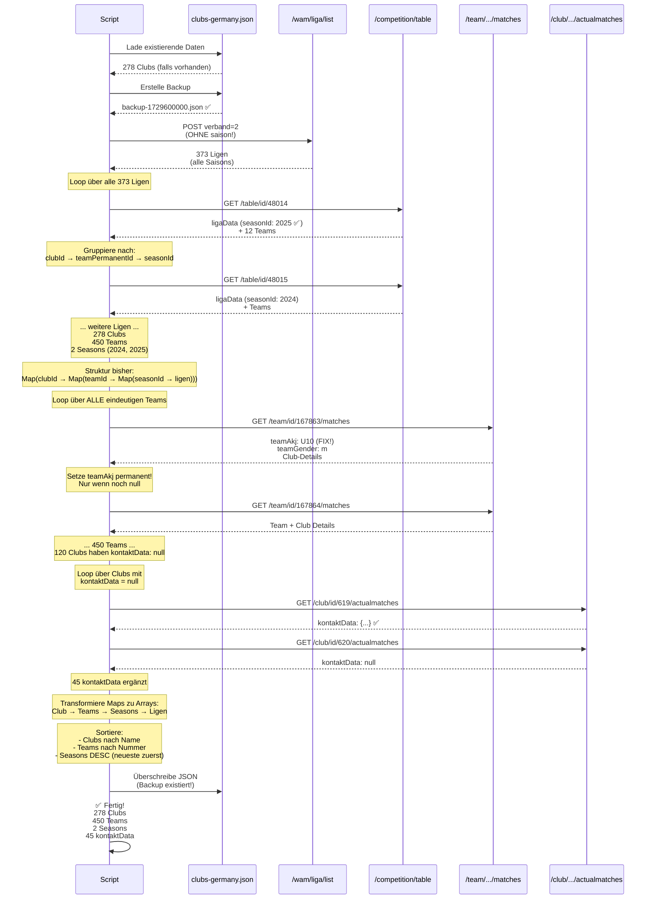

# BBB Club Crawler v2 - API Sequenz



## API-Endpunkte im Detail

### 1. `/wam/liga/list`
**Problem:** `seasonId: null` ❌  
**Nutzung:** Liste aller `ligaId`s  
**Wichtig:** **KEIN** `saison` Parameter - wir wollen alle Saisons!

### 2. `/competition/table/id/:ligaId`
**Wichtig:** `ligaData.seasonId: 2025` ✅  
**Nutzung:** Korrekte Season-Daten + Teams

**Response:**
```json
{
  "data": {
    "ligaData": {
      "ligaId": 48014,
      "liganame": "U10 Bezirksliga",
      "seasonId": 2025,        // ← HIER!
      "seasonName": "2025/2026",
      "akName": "U10"
    },
    "tabelle": {
      "entries": [
        {
          "team": {
            "clubId": 619,
            "teamPermanentId": "167863",
            "teamCompetitionId": "401234"
          }
        }
      ]
    }
  }
}
```

### 3. `/team/id/:teamPermanentId/matches`
**Liefert:**
- **Team-Details:** `teamAkj` (FIX!), `teamGender`, `teamNumber`
- **Club-Details:** `vereinsname`, `vereinsnummer`, `kontaktData`

**Wichtig:**
- `teamAkj` ist **PERMANENT** - wird NUR EINMAL gesetzt
- Überschreibe `teamAkj` NICHT bei weiteren Ligen!

**Response:**
```json
{
  "data": {
    "team": {
      "teamPermanentId": "167863",
      "teamAkjId": 10,
      "teamAkj": "U10",      // ← FIX! Bleibt immer U10
      "teamGenderId": 1,
      "teamGender": "m",
      "teamNumber": 3,
      "club": {
        "vereinsname": "FC Bayern München e.V.",
        "vereinsnummer": "0212033",
        "kontaktData": {...}
      }
    }
  }
}
```

### 4. `/club/id/:clubId/actualmatches`
**Nutzung:** Fehlende `kontaktData` ergänzen  
**Nur für:** Clubs mit `kontaktData === null`

**Response:**
```json
{
  "data": {
    "club": {
      "kontaktData": {
        "street": "Säbener Straße 51",
        "zipCode": "81547",
        "city": "München"
      }
    }
  }
}
```

## Daten-Transformation

### Maps während Verarbeitung:
```javascript
Map<clubId, {
  clubId,
  vereinsname,
  verbaende,
  teams: Map<teamPermanentId, {
    teamPermanentId,
    teamAkj,        // ← FIX! Einmal gesetzt
    teamGender,
    seasons: Map<seasonId, {
      seasonId,
      seasonName,
      ligen: [...]
    }>
  }>
}>
```

### Arrays im Output:
```json
{
  "clubs": [
    {
      "clubId": "619",
      "teams": [
        {
          "teamPermanentId": "167863",
          "teamAkj": "U10",  // ← FIX!
          "seasons": [
            {
              "seasonId": 2025,
              "ligen": [...]
            }
          ]
        }
      ]
    }
  ]
}
```

## Timing

- **373 Ligen** × 100ms = ~37s (Schritt 1 + 2)
- **450 Teams** × 100ms = ~45s (Schritt 3)
- **100 Clubs** × 100ms = ~10s (Schritt 4)
- **Transform + Save:** ~5s
- **Total:** ~97s ≈ **1.6 Minuten**

## Wichtige Regeln

1. ✅ **seasonId von ligaData** - Nicht von liga!
2. ✅ **teamAkj ist FIX** - Nur einmal setzen
3. ✅ **Ligen unter Seasons** - Nicht direkt am Team
4. ✅ **Liga-AK kann höher sein** - U10 Team in U12 Liga
5. ✅ **Maps für Dedup** - Arrays für Output
6. ✅ **Smart Merge** - Nur null-Werte überschreiben
