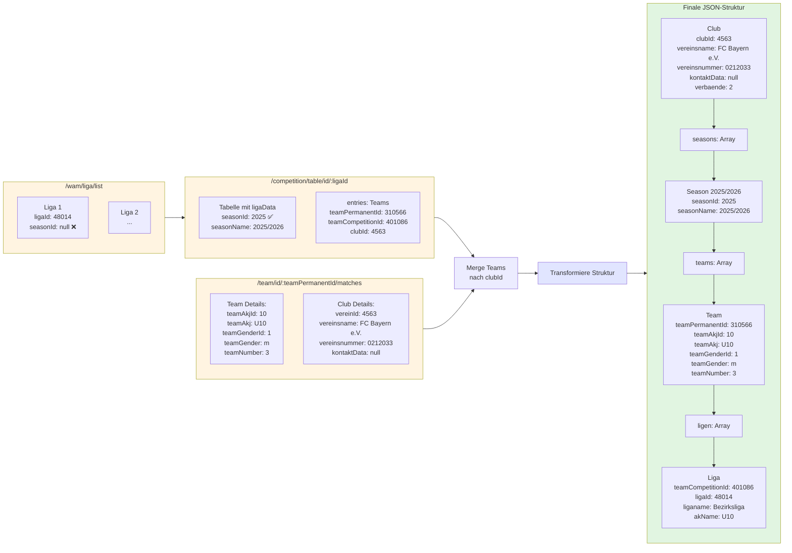

# BBB Club Crawler v2 - Datenstruktur

## API-Transformation



## Finale JSON-Struktur

```json
{
  "clubs": [
    {
      "clubId": "619",
      "vereinsname": "FC Bayern München e.V.",
      "vereinsnummer": "0212033",
      "kontaktData": null,
      "verbaende": [2],
      
      "teams": [
        {
          "teamPermanentId": "167863",
          "teamname": "FC Bayern München 3",
          "teamnameSmall": "FCB3",
          
          "teamAkjId": 10,
          "teamAkj": "U10",  // ← FIX! Bleibt immer U10
          "teamGenderId": 1,
          "teamGender": "m",
          "teamNumber": 3,
          
          "seasons": [
            {
              "seasonId": 2025,
              "seasonName": "2025/2026",
              
              "ligen": [
                {
                  "teamCompetitionId": "401234",
                  "ligaId": "48014",
                  "liganame": "U12 Bezirksliga",
                  "akName": "U12",  // ← Liga kann höher sein!
                  "geschlechtId": 1,
                  "geschlecht": "männlich"
                }
              ]
            },
            {
              "seasonId": 2024,
              "seasonName": "2024/2025",
              "ligen": [...]  // Team spielte auch letzte Saison
            }
          ]
        }
      ]
    }
  ]
}
```

## Hierarchie

```
Club (vereinsname, vereinsnummer, kontaktData)
  └─ Teams (teamPermanentId, teamAkj, teamGender, teamNumber) ← PERMANENT!
      └─ Seasons (seasonId, seasonName)
          └─ Ligen (ligaId, liganame, akName)
```

**Wichtige Regeln:**
- **teamAkj ist FIX** - Ein U10-Team bleibt immer U10
- **Team spielt über Saisons** - Gleiche Kinder, verschiedene Jahre
- **Liga-AK kann höher sein** - U10 Team in U12 Liga (erlaubt)
- **Liga-AK kann NICHT niedriger sein** - U12 Team in U10 Liga (verboten)
- **Senioren = höchste AK** - Teams können "aufsteigen" zu Senioren

## Vorteile

1. **Team-Zentrierung** - Team als permanente Entität
2. **Historische Daten** - Team-Historie über Saisons
3. **Multi-Liga** - Team in Liga + Pokal gleichzeitig
4. **Club-Zentriert** - Keine Duplikate
5. **Korrekte Semantik** - Spiegelt Basketball-Realität
