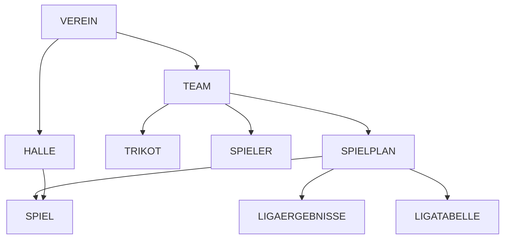

# Schema-Analyse: Userflows vs. Aktuelle Implementierung

**Analysedatum:** 11. Oktober 2025  
**Status:** Bedeutende Diskrepanzen zwischen Dokumentation und Implementierung

---

## Executive Summary

Die Userflow-Dokumente und das Datenbankschema v3.0 beschreiben einen **deutlich erweiterten Funktionsumfang** für BBB-Integration, Multi-Team-Support und Benchmark-Analysen. Die aktuelle Implementierung befindet sich in einem frühen MVP-Stadium und deckt nur grundlegende Spieler- und Spielverwaltung ab.

**Kritische Erkenntnisse:**
- ❌ **7 von 10 Kern-Tabellen fehlen komplett**
- ⚠️ **Bestehende Tabellen (SPIEL, SPIELER) unvollständig**
- 🆕 **BBB-Integration komplett fehlend**
- 🆕 **Multi-Team-Support nicht vorhanden**

---

## 1. Fehlende Tabellen (Komplett neu zu implementieren)

### 1.1 TEAM (Priorität: KRITISCH ⚠️)
**Status:** ❌ Fehlt komplett  
**Auswirkung:** Grundlegende Multi-Team-Funktionalität unmöglich

**Benötigte Felder laut Schema:**
```typescript
interface Team {
  team_id: UUID;
  verein_id: UUID;           // FK zu VEREIN
  bbb_mannschafts_id?: string;  // BBB-Sync
  name: string;
  altersklasse: Altersklasse;
  saison: string;
  trainer: string;
  leistungsorientiert?: boolean;  // U12 Sonderregeln
  created_at: Date;
}
```

**Benötigte Domains/Services:**
- `domains/team/models/Team.ts`
- `domains/team/services/TeamService.ts`
- `domains/team/components/TeamVerwaltung.tsx`

---

### 1.2 SPIELPLAN (Priorität: KRITISCH ⚠️)
**Status:** ❌ Fehlt komplett  
**Auswirkung:** BBB-Integration, automatischer Sync unmöglich

**Benötigte Felder laut Schema v3.1:**
```typescript
interface Spielplan {
  spielplan_id: UUID;
  team_id: UUID;              // FK zu TEAM
  saison: string;
  liga?: string;
  altersklasse?: string;
  
  // BBB-Integration (NEU in v3.0)
  bbb_spielplan_url?: string;   // User-Input: Eine BBB-Liga-URL
  bbb_tabelle_url?: string;     // Automatisch generiert
  bbb_ergebnisse_url?: string;  // Automatisch generiert
  liga_nr_offiziell?: string;   // Aus BBB-Titel extrahiert
  syncam?: Date;                // Letzter Sync-Zeitstempel
}
```

**Benötigte Domains/Services:**
- `domains/spielplan/models/Spielplan.ts`
- `domains/spielplan/services/SpielplanService.ts`
- `domains/spielplan/services/BBBSyncService.ts` (BBB-Parser)
- `domains/spielplan/components/SpielplanImport.tsx`

---

### 1.3 LIGAERGEBNISSE (Priorität: HOCH 🔴)
**Status:** ❌ Fehlt komplett  
**Auswirkung:** Benchmark-Analysen unmöglich

**Benötigte Felder:**
```typescript
interface LigaErgebnis {
  id: UUID;
  ligaid: UUID;               // FK zu SPIELPLAN
  spielnr?: number;           // Match mit SPIEL
  heimteam: string;
  gastteam: string;
  ergebnisheim: number;
  ergebnisgast: number;
  datum: Date;
  syncam: Date;
}
```

**Benötigte Domains/Services:**
- `domains/liga/models/LigaErgebnis.ts`
- `domains/liga/services/BenchmarkService.ts`

---

### 1.4 LIGATABELLE (Priorität: MITTEL 🟡)
**Status:** ❌ Fehlt komplett  
**Auswirkung:** Dashboard-Tabellenanzeige fehlt

**Benötigte Felder:**
```typescript
interface LigaTabelle {
  id: UUID;
  ligaid: UUID;
  teamname: string;
  platz: number;
  spiele: number;
  siege: number;
  niederlagen: number;
  punkte: number;
  korbeerzielt: number;
  korbeerhalten: number;
  korbdifferenz: number;
  heimsiege: number;
  heimniederlagen: number;
  auswaertssiege: number;
  auswaertsniederlagen: number;
  syncam: Date;
}
```

---

### 1.5 VEREIN (Priorität: HOCH 🔴)
**Status:** ❌ Fehlt komplett  
**Auswirkung:** BBB-Sync, Vereinszuordnung unmöglich

**Benötigte Felder:**
```typescript
interface Verein {
  verein_id: UUID;
  bbb_kontakt_id?: string;
  verband_id?: number;        // 2 = Bayern
  name: string;
  kurzname?: string;
  ort?: string;
  ist_eigener_verein: boolean;
  sync_am?: Date;
}
```

---

### 1.6 HALLE (Priorität: HOCH 🔴)
**Status:** ❌ Fehlt komplett  
**Auswirkung:** Spielortinformationen, Navigation fehlen

**Benötigte Felder:**
```typescript
interface Halle {
  halle_id: UUID;
  bbb_halle_id?: string;
  name: string;
  strasse: string;
  plz: string;
  ort: string;
  verein_id?: UUID;
  anzahl_felder?: number;
  parken?: string;            // ⚠️ Wichtig für Auswärtsspiele!
  oepnv?: string;             // ⚠️ Wichtig für Auswärtsspiele!
  notizen?: string;
  sync_am?: Date;
}
```

---

### 1.7 TRIKOT (Priorität: HOCH 🔴)
**Status:** ❌ Fehlt komplett  
**Auswirkung:** Trikotvergabe, Einsatzplanung beeinträchtigt

**Benötigte Felder:**
```typescript
interface Trikot {
  trikot_id: UUID;
  team_id: UUID;
  art: 'Wendejersey' | 'Hose';
  nummer?: string;            // Nur bei Jersey
  groesse: string;            // 3xs, 2xs, xs...
  eu_groesse: number;         // 116-170
  farbe_dunkel?: string;
  farbe_hell?: string;
  status: 'verfügbar' | 'im_einsatz' | 'defekt';
  besonderheiten?: string;
  created_at: Date;
}
```

---

## 2. Unvollständige Tabellen (Erweiterungen nötig)

### 2.1 SPIEL ⚠️
**Status:** ⚙️ Teilweise vorhanden, aber BBB-Felder fehlen  
**Aktuelle Implementierung:**
```typescript
// src/domains/spiel/models/Spiel.ts
interface Spiel {
  spiel_id: UUID;
  team_id: UUID;
  gegner_name: string;
  spieltermin: Date;
  spielort: string;
  altersklasse: Altersklasse;
  status: SpielStatus;
  aktuelle_phase: SpielPhase;
  aktuelles_achtel: number;
  timer_laufend: boolean;
  verstrichene_sekunden: number;
  created_at: Date;
}
```

**Fehlende Felder laut Schema v3.0:**
```typescript
interface SpielErweitert extends Spiel {
  spielplanid?: UUID;         // FK zu SPIELPLAN
  spielnr?: number;           // ⚠️ BBB-Spielnummer (Primary Match-Key!)
  spieltag?: number;          // ⚠️ BBB-Spieltag
  halle_id?: UUID;            // FK zu HALLE
  ergebnisheim?: number;
  ergebnisgast?: number;
  // ... weitere Felder aus Schema-Designer
}
```

**Migration benötigt:**
- ALTER TABLE in SimpleDatabaseService
- Versionierung von 2.0 → 3.0
- Indizes für `spielnr` und `datum`

---

### 2.2 SPIELER ⚙️
**Status:** ⚙️ Grundstruktur vorhanden, Minor-Anpassungen nötig  
**Aktuelle Implementierung:**
```typescript
// src/domains/spieler/models/Spieler.ts
interface Spieler {
  spieler_id: UUID;
  team_id: UUID;              // ⚠️ Sollte optional sein für Gegner!
  vorname: string;
  nachname: string;
  geburtsdatum?: Date;
  spieler_typ: SpielerTyp;
  mitgliedsnummer?: string;
  tna_nr?: string;
  konfektionsgroesse_jersey?: number;
  konfektionsgroesse_hose?: number;
  in_easyVerein: boolean;
  aktiv: boolean;
  created_at: Date;
  updated_at?: Date;
}
```

**Empfohlene Anpassung laut Schema-Designer:**
```typescript
interface SpielerAngepasst extends Spieler {
  team_id?: UUID;             // Optional für Gegner-Spieler
  verein_id?: UUID;           // NEU: Für Gegner-Tracking
}
```

---

## 3. Domain-Driven Design Struktur

### 3.1 Bestehende Domains ✅
```
src/domains/
├── einsatzplan/           ✅ Implementiert
│   ├── models/
│   ├── services/
│   └── components/
├── spiel/                 ⚠️ Unvollständig
│   ├── models/
│   ├── services/
│   └── components/
└── spieler/               ⚠️ Unvollständig
    ├── models/
    ├── services/
    └── components/
```

### 3.2 Fehlende Domains ❌
```
src/domains/
├── team/                  ❌ FEHLT - KRITISCH!
├── spielplan/             ❌ FEHLT - KRITISCH!
├── verein/                ❌ FEHLT
├── halle/                 ❌ FEHLT
├── trikot/                ❌ FEHLT
└── liga/                  ❌ FEHLT
```

---

## 4. Database Service Erweiterungen

### 4.1 SimpleDatabaseService v2.0 → v3.0 Migration

**Aktuelle Version:** 2.0  
**Ziel-Version:** 3.0

**Notwendige Änderungen:**
```typescript
interface DatabaseSchema {
  // ✅ Bestehend
  spieler: Spieler[];
  bewertungen: SpielerBewertung[];
  erziehungsberechtigte: Erziehungsberechtigte[];
  spieler_erziehungsberechtigte: SpielerErziehungsberechtigte[];
  einsatzplaene: SpielerEinsatz[];
  spiele: Spiel[];
  
  // ❌ NEU HINZUFÜGEN
  teams: Team[];                        // KRITISCH!
  spielplaene: Spielplan[];             // KRITISCH!
  ligaergebnisse: LigaErgebnis[];       // WICHTIG
  ligatabelle: LigaTabelle[];           // Optional
  vereine: Verein[];
  hallen: Halle[];
  trikots: Trikot[];
}
```

**Migration-Script benötigt:**
```typescript
private migrate_v2_to_v3(): void {
  // 1. SPIEL-Tabelle erweitern
  this.data.spiele = this.data.spiele.map(spiel => ({
    ...spiel,
    spielnr: null,
    spieltag: null,
    spielplanid: null,
    halle_id: null
  }));
  
  // 2. Neue Tabellen initialisieren
  this.data.teams = [];
  this.data.spielplaene = [];
  this.data.ligaergebnisse = [];
  this.data.ligatabelle = [];
  this.data.vereine = [];
  this.data.hallen = [];
  this.data.trikots = [];
  
  // 3. Version aktualisieren
  localStorage.setItem(VERSION_KEY, '3.0');
}
```

---

## 5. BBB-Integration: Komplett fehlend ⚠️

### 5.1 BBB-Sync-Service
**Status:** ❌ Nicht vorhanden  
**Benötigt:** Komplette Neu-Implementierung

**Anforderungen laut Dokumentation:**
```typescript
// domains/spielplan/services/BBBSyncService.ts
class BBBSyncService {
  // 1. URL-Parser
  extractLigaId(url: string): string;
  buildTabelleUrl(ligaId: string): string;
  buildErgebnisseUrl(ligaId: string): string;
  
  // 2. HTML-Parser
  async fetchAndParse(url: string): Promise<BBBData>;
  parseSpielplan(html: string): Spiel[];
  parseTabelle(html: string): LigaTabelle[];
  parseErgebnisse(html: string): LigaErgebnis[];
  
  // 3. Sync-Logik
  async syncSpielplan(spielplanId: UUID): Promise<void>;
  async syncAllTeams(): Promise<void>;
  compareAndUpdate(spielplanId: UUID, newData: Spiel[]): Promise<Change[]>;
}
```

### 5.2 Onboarding-Flow
**Status:** ❌ Nicht vorhanden  
**Dokumentiert in:** `app-start_onboarding_flow_v3.md` (LEER!)

**Benötigt:**
- CSV-Import für Spieler
- CSV-Import für Trikots
- BBB-URL-Eingabe
- Team-Erstellung

---

## 6. WCAG 2.0 AA Compliance

### 6.1 Aktuelle Situation
**Status:** ⚠️ Nicht getestet, wahrscheinlich nicht compliant

**Benötigte Prüfungen:**
- [ ] Farbkontraste (mindestens 4.5:1 für normalen Text)
- [ ] Tastaturnavigation
- [ ] Screen Reader Support
- [ ] ARIA-Labels
- [ ] Focus Management

**Empfohlene Tools:**
- axe DevTools
- WAVE Browser Extension
- Lighthouse Accessibility Audit

---

## 7. Testing-Status

### 7.1 Unit Tests
**Status:** ❌ Nicht vorhanden  
**Benötigt:** Komplette Test-Suite

**Minimum für Schema-Änderungen:**
```
tests/
├── domains/
│   ├── team/
│   │   └── TeamService.test.ts
│   ├── spielplan/
│   │   ├── SpielplanService.test.ts
│   │   └── BBBSyncService.test.ts
│   └── liga/
│       └── BenchmarkService.test.ts
└── shared/
    └── db/
        └── SimpleDatabaseService.test.ts (Migration v2→v3)
```

### 7.2 PACT Tests
**Status:** ❌ Nicht vorhanden  
**Benötigt:** Consumer/Provider Tests für BBB-Integration

---

## 8. Priorisierung der Änderungen

### Phase 1: KRITISCHE Grundlagen (Blocker für alles andere)
**Geschätzter Aufwand:** 3-5 Arbeitstage

1. ✅ **TEAM-Domain erstellen** (models, services, components)
2. ✅ **VEREIN-Domain erstellen**
3. ✅ **SimpleDatabaseService v3.0 Migration**
4. ✅ **SPIELPLAN-Domain Grundstruktur**
5. ✅ **SPIEL-Tabelle erweitern** (spielnr, spieltag)

### Phase 2: BBB-Integration (Kern-Feature)
**Geschätzter Aufwand:** 5-7 Arbeitstage

1. ✅ **BBBSyncService** (URL-Parser, HTML-Parser)
2. ✅ **LIGAERGEBNISSE-Domain**
3. ✅ **LIGATABELLE-Domain**
4. ✅ **Onboarding-Flow UI**

### Phase 3: Erweiterte Features
**Geschätzter Aufwand:** 3-4 Arbeitstage

1. ✅ **HALLE-Domain**
2. ✅ **TRIKOT-Domain**
3. ✅ **Benchmark-Analyse**

### Phase 4: Quality & Testing
**Geschätzter Aufwand:** 3-5 Arbeitstage

1. ✅ **Unit Tests** (alle Domains)
2. ✅ **PACT Tests** (BBB-Integration)
3. ✅ **WCAG 2.0 AA Audit**
4. ✅ **E2E Tests** (Onboarding-Flow)

---

## 9. Risiken & Abhängigkeiten

### 9.1 Technische Risiken
1. **BBB-HTML-Parsing:** Struktur-Änderungen brechen Parser
2. **Migration v2→v3:** Datenverlust bei bestehenden Usern
3. **Offline-Sync:** Konflikte bei parallelen Änderungen

### 9.2 Abhängigkeiten


**Kritischer Pfad:**
VEREIN → TEAM → SPIELPLAN → BBB-Integration

---

## 10. Empfohlenes Vorgehen

### Option A: Inkrementelle Migration (Empfohlen ✅)
**Vorteile:** Geringeres Risiko, kontinuierliche Deployment-Fähigkeit  
**Nachteile:** Längere Gesamtdauer

**Schritte:**
1. Phase 1 implementieren und testen
2. Database Migration v2→v3 mit Fallback
3. Phase 2 implementieren
4. Schrittweise Features aktivieren

### Option B: Big Bang Migration
**Vorteile:** Schnellere Komplettierung  
**Nachteile:** Hohes Risiko, keine Zwischenstände deploybar

**Nicht empfohlen** für Produktions-System

---

## 11. Zusammenfassung

### Was funktioniert bereits ✅
- Spieler-Verwaltung (Basis)
- Bewertungs-System
- Erziehungsberechtigte
- Einsatzplan-Visualisierung (Basis)

### Was fehlt komplett ❌
- Multi-Team-Support (TEAM, VEREIN)
- BBB-Integration (SPIELPLAN, Sync-Service)
- Benchmark-Analysen (LIGAERGEBNISSE)
- Trikot-Management
- Hallen-Verwaltung

### Geschätzter Gesamt-Aufwand
**14-21 Arbeitstage** für vollständige Implementierung gemäß Schema v3.0

---

**Nächste Schritte:**
1. Entscheidung über Migrations-Strategie
2. Priorisierung der Phasen
3. Start mit Phase 1 (TEAM, VEREIN, Migration)
