# 🗄️ Datenmodell - Basketball Team Manager

**Version:** 5.0  
**Datenbank:** Dexie.js (IndexedDB)  
**Stand:** 24. Oktober 2025

---

## 📋 Inhaltsverzeichnis

1. [Übersicht](#übersicht)
2. [Entity-Relationship-Diagramm](#entity-relationship-diagramm)
3. [Core Entities](#core-entities)
4. [Domain Entities](#domain-entities)
5. [Input Types (Service Layer)](#input-types-service-layer)
6. [Indizes & Performance](#indizes--performance)
7. [Migrations](#migrations)
8. [DSGVO & Datenschutz](#dsgvo--datenschutz)

---

## 🎯 Übersicht

### Datenbank-Struktur
```
24 Tabellen | IndexedDB v5 | Offline-First
```

### Kategorien
```
├── 👤 User & Trainer (1 Tabelle)
├── 🏢 Vereine & Teams (2 Tabellen)
├── 🏀 Spieler & Bewertungen (5 Tabellen)
├── 🏟️ Hallen & Ligen (3 Tabellen)
├── 📅 Spielplan & Spiele (5 Tabellen)
├── 👕 Trikots (1 Tabelle)
├── 🎮 Einsatzplanung (2 Tabellen)
├── 🏋️ Training (4 Tabellen)
└── 📝 Notizen & Archiv (2 Tabellen)
```

### Daten-Quellen
- **Lokal:** Spieler, Trikots, Bewertungen, Notizen
- **BBB-API:** Vereine, Teams, Ligen, Spiele, Tabellen
- **Hybrid:** Teams (können lokal oder API-synced sein)

---

## 📊 Entity-Relationship-Diagramm

```mermaid
erDiagram
    %% ============================================
    %% CORE: USER, VEREIN, TEAM
    %% ============================================
    
    USER ||--o{ TEAM : "trainiert"
    USER {
        UUID user_id PK "Primary Key"
        string vorname "REQUIRED"
        string nachname "REQUIRED"
        string name "Vollständiger Name"
        string email "Optional"
        date created_at "REQUIRED"
    }
    
    VEREIN ||--o{ TEAM : "hat"
    VEREIN {
        UUID verein_id PK "Primary Key"
        string extern_verein_id "BBB clubId (optional)"
        string bbb_kontakt_id "Optional"
        int verband_id "Legacy single ID (optional)"
        int[] verband_ids "Neue Struktur (optional)"
        string name "REQUIRED"
        string kurzname "Optional"
        string ort "REQUIRED"
        boolean ist_eigener_verein "REQUIRED"
        date sync_am "Optional"
        date created_at "REQUIRED"
    }
    
    TEAM ||--o{ SPIELER : "hat"
    TEAM ||--o{ SPIEL : "spielt"
    TEAM ||--o{ TRIKOT : "hat"
    TEAM {
        UUID team_id PK "Primary Key"
        string extern_team_id "BBB teamId (optional)"
        UUID verein_id FK "REQUIRED"
        UUID user_id FK "Optional - nur bei team_typ=eigen"
        string bbb_mannschafts_id "Optional"
        string name "REQUIRED"
        Altersklasse altersklasse "REQUIRED: U8|U10|U12..."
        int altersklasse_id "BBB Altersklasse-ID (optional)"
        string geschlecht "Optional: male|female|mixed"
        string saison "REQUIRED: 2025/2026"
        string trainer "REQUIRED"
        TeamTyp team_typ "REQUIRED: eigen|gegner"
        string liga_id "Optional: BBB Liga-ID"
        string liga_name "Optional"
        boolean leistungsorientiert "Optional - nur U12"
        date created_at "REQUIRED"
        date updated_at "Optional"
    }
    
    %% ============================================
    %% SPIELER & BEWERTUNGEN
    %% ============================================
    
    SPIELER ||--o{ SPIELERBEWERTUNG : "hat"
    SPIELER ||--o{ SPIELER_ERZ : "hat"
    SPIELER ||--o{ SPIELEREINSATZ : "hat"
    SPIELER ||--o{ TRAINING_TEILNAHME : "nimmt_teil"
    SPIELER ||--o{ SPIELERNOTIZ : "hat"
    SPIELER {
        UUID spieler_id PK "Primary Key"
        string extern_spieler_id "BBB playerId (optional)"
        UUID team_id FK "REQUIRED"
        UUID verein_id FK "Optional - für Gegner"
        string vorname "REQUIRED"
        string nachname "REQUIRED"
        int trikotnummer "Optional - aus Match-Info"
        string tna_letzten_drei "Optional - letzte 3 Stellen TNA"
        date geburtsdatum "Optional"
        SpielerTyp spieler_typ "REQUIRED: eigenes_team|gegner|scouting"
        string mitgliedsnummer "Optional"
        string tna_nr "Optional - vollständig"
        int konfektionsgroesse_jersey "Optional: 116-170"
        int konfektionsgroesse_hose "Optional: 116-170"
        boolean aktiv "REQUIRED"
        date created_at "REQUIRED"
        date updated_at "Optional"
    }
    
    ERZIEHUNGSBERECHTIGTE ||--o{ SPIELER_ERZ : "betreut"
    ERZIEHUNGSBERECHTIGTE {
        UUID erz_id PK "Primary Key"
        string vorname "REQUIRED"
        string nachname "REQUIRED"
        string telefon_mobil "REQUIRED"
        string email "REQUIRED"
        boolean datenschutz_akzeptiert "REQUIRED"
        date created_at "REQUIRED"
    }
    
    SPIELER_ERZ {
        UUID se_id PK "Primary Key"
        UUID spieler_id FK "REQUIRED"
        UUID erz_id FK "REQUIRED"
        Beziehungstyp beziehung "REQUIRED: Mutter|Vater..."
        boolean ist_notfallkontakt "REQUIRED"
        boolean abholberechtigt "REQUIRED"
        date created_at "REQUIRED"
    }
    
    SPIELERBEWERTUNG {
        UUID bewertung_id PK "Primary Key"
        UUID spieler_id FK "REQUIRED"
        BewertungsTyp bewertungs_typ "REQUIRED: aktuell|scouting|archiv"
        string saison "REQUIRED"
        Altersklasse altersklasse "REQUIRED"
        date gueltig_ab "REQUIRED"
        date gueltig_bis "Optional"
        string bewertet_von "REQUIRED"
        int ballhandling_score "1-3, Default: 2"
        int passen_fangen_score "1-3, Default: 2"
        int spieluebersicht_score "1-3, Default: 2"
        int teamplay_score "1-3, Default: 2"
        int defense_score "1-3, Default: 2"
        int laufbereitschaft_score "1-3, Default: 2"
        int rebound_score "1-3, Default: 2"
        int positionsflex_score "1-3, Default: 2"
        int abschluss_score "1-3, Default: 2"
        float gesamt_wert "Berechnet"
        string notizen "Optional"
        date created_at "REQUIRED"
    }
    
    %% ============================================
    %% LIGEN & SPIELE
    %% ============================================
    
    LIGA ||--o{ LIGATEILNAHME : "hat"
    LIGA ||--o{ SPIEL : "enthält"
    LIGA ||--o{ LIGATABELLE : "hat"
    LIGA {
        UUID liga_id PK "Primary Key"
        string bbb_liga_id "BBB Liga-ID (optional)"
        int verband_id "Optional"
        string name "REQUIRED"
        string saison "REQUIRED"
        Altersklasse altersklasse "REQUIRED"
        string spielklasse "Optional: Bezirksliga..."
        string region "Optional: Oberpfalz..."
        date sync_am "Optional"
        date created_at "REQUIRED"
    }
    
    LIGATEILNAHME {
        UUID teilnahme_id PK "Primary Key"
        UUID liga_id FK "REQUIRED"
        UUID verein_id FK "REQUIRED"
        UUID team_id FK "Optional"
        int platzierung "Optional"
        int spiele "Optional"
        int siege "Optional"
        int niederlagen "Optional"
        int punkte "Optional"
        date created_at "REQUIRED"
    }
    
    HALLE ||--o{ SPIEL : "Austragungsort"
    HALLE {
        UUID halle_id PK "Primary Key"
        string bbb_halle_id "Optional"
        string name "REQUIRED"
        string strasse "REQUIRED"
        string plz "REQUIRED"
        string ort "REQUIRED"
        UUID verein_id FK "Optional"
        int anzahl_felder "Optional"
        string parken "Optional"
        string oepnv "Optional"
        string notizen "Optional"
        date sync_am "Optional"
        date created_at "REQUIRED"
    }
    
    SPIELPLAN ||--o{ SPIEL : "enthält"
    SPIELPLAN {
        UUID spielplan_id PK "Primary Key"
        UUID team_id FK "REQUIRED"
        string saison "REQUIRED"
        string liga "Optional"
        string altersklasse "Optional"
        string bbb_spielplan_url "Optional"
        string bbb_tabelle_url "Optional"
        string bbb_ergebnisse_url "Optional"
        string liga_nr_offiziell "Optional"
        date syncam "Optional"
        date created_at "REQUIRED"
    }
    
    SPIEL ||--o{ SPIELEREINSATZ : "hat"
    SPIEL ||--o{ ACHTELSTATISTIK : "hat"
    SPIEL {
        UUID spiel_id PK "Primary Key"
        string extern_spiel_id "BBB matchId (optional)"
        UUID spielplan_id FK "Optional"
        UUID team_id FK "REQUIRED"
        UUID liga_id FK "Optional"
        int spielnr "Optional - BBB Spielnummer"
        int spieltag "Optional - BBB Spieltag"
        date datum "REQUIRED"
        string uhrzeit "Optional"
        UUID heim_team_id FK "Optional"
        UUID gast_team_id FK "Optional"
        string heim "Team-Name (legacy)"
        string gast "Team-Name (legacy)"
        UUID halle_id FK "Optional"
        boolean ist_heimspiel "REQUIRED"
        int ergebnis_heim "Optional"
        int ergebnis_gast "Optional"
        SpielStatus status "REQUIRED: geplant|live|abgeschlossen|abgesagt"
        Altersklasse altersklasse "REQUIRED"
        boolean leistungsorientiert "Optional"
        float durchschnitt_team_score "Optional"
        float balance_index "Optional"
        string notizen "Optional"
        date created_at "REQUIRED"
        date updated_at "Optional"
    }
    
    LIGATABELLE {
        UUID id PK "Primary Key"
        UUID ligaid FK "REQUIRED"
        string teamname "REQUIRED"
        int platz "REQUIRED"
        int spiele "REQUIRED"
        int siege "REQUIRED"
        int niederlagen "REQUIRED"
        int punkte "REQUIRED"
        int korbe_erzielt "REQUIRED"
        int korbe_erhalten "REQUIRED"
        int korb_differenz "REQUIRED"
        int heim_siege "REQUIRED"
        int heim_niederlagen "REQUIRED"
        int auswaerts_siege "REQUIRED"
        int auswaerts_niederlagen "REQUIRED"
        date syncam "REQUIRED"
    }
    
    %% ============================================
    %% TRIKOTS & EINSATZPLANUNG
    %% ============================================
    
    TRIKOT {
        UUID trikot_id PK "Primary Key"
        UUID team_id FK "REQUIRED"
        TrikotArt art "REQUIRED: Wendejersey|Hose"
        string nummer "Optional"
        TrikotGroesse groesse "REQUIRED: xs|s|m|l|xl..."
        int eu_groesse "116-170"
        string farbe_dunkel "Optional"
        string farbe_hell "Optional"
        TrikotStatus status "REQUIRED: verfügbar|im_einsatz|defekt"
        string besonderheiten "Optional"
        date created_at "REQUIRED"
    }
    
    SPIELEREINSATZ {
        UUID einsatz_id PK "Primary Key"
        UUID spiel_id FK "REQUIRED"
        UUID spieler_id FK "REQUIRED"
        UUID jersey_id FK "REQUIRED"
        UUID hose_id FK "REQUIRED"
        int position "REQUIRED"
        EinsatzStatus q1_1 "Im_Spiel|Bank"
        EinsatzStatus q1_2 "Im_Spiel|Bank"
        EinsatzStatus q2_1 "Im_Spiel|Bank"
        EinsatzStatus q2_2 "Im_Spiel|Bank"
        EinsatzStatus q3_1 "Im_Spiel|Bank"
        EinsatzStatus q3_2 "Im_Spiel|Bank"
        EinsatzStatus q4_1 "Im_Spiel|Bank"
        EinsatzStatus q4_2 "Im_Spiel|Bank"
        int pausen "Berechnet"
        int gespielt "Berechnet"
        date created_at "REQUIRED"
        date updated_at "Optional"
    }
    
    ACHTELSTATISTIK {
        UUID achtel_stat_id PK "Primary Key"
        UUID spiel_id FK "REQUIRED"
        int achtel_nummer "1-8"
        float team_score "REQUIRED"
        int spieler_auf_feld "3|4|5"
        float ballhandling_avg "Optional"
        float defense_avg "Optional"
        date berechnet_am "REQUIRED"
    }
    
    %% ============================================
    %% TRAINING & PROBETRAINING
    %% ============================================
    
    TRAINING ||--o{ TRAINING_TEILNAHME : "hat"
    TRAINING {
        UUID training_id PK "Primary Key"
        UUID team_id FK "REQUIRED"
        date datum "REQUIRED"
        int dauer_minuten "REQUIRED"
        UUID halle_id FK "Optional"
        string trainer "REQUIRED"
        boolean ist_probetraining "REQUIRED"
        string fokus "Optional"
        string notizen "Optional"
        date created_at "REQUIRED"
    }
    
    TRAINING_TEILNAHME {
        UUID teilnahme_id PK "Primary Key"
        UUID training_id FK "REQUIRED"
        UUID spieler_id FK "REQUIRED"
        boolean anwesend "REQUIRED"
        boolean entschuldigt "Optional"
        string notiz "Optional"
    }
    
    PROBETRAINING_TEILNEHMER ||--o{ PROBETRAINING_HISTORIE : "hat"
    PROBETRAINING_TEILNEHMER {
        UUID probe_id PK "Primary Key"
        string vorname "REQUIRED"
        string nachname "Optional"
        int anzahl_teilnahmen "REQUIRED"
        string eltern_telefon "Optional"
        string eltern_email "Optional"
        date geburtsdatum "Optional"
        Altersklasse altersklasse "Optional"
        ProbetrainingStatus status "aktiv|interessiert|aufgenommen|abgesagt"
        UUID aufgenommen_als_spieler_id FK "Optional"
        string notizen "Optional"
        date created_at "REQUIRED"
    }
    
    PROBETRAINING_HISTORIE {
        UUID historie_id PK "Primary Key"
        UUID probe_id FK "REQUIRED"
        UUID training_id FK "REQUIRED"
        date datum "REQUIRED"
        boolean anwesend "REQUIRED"
        string notiz "Optional"
    }
    
    %% ============================================
    %% NOTIZEN & ARCHIV
    %% ============================================
    
    SPIELERNOTIZ {
        UUID notiz_id PK "Primary Key"
        UUID spieler_id FK "REQUIRED"
        date datum "REQUIRED"
        NotizKategorie kategorie "Entwicklung|Verhalten|Gesundheit..."
        string titel "REQUIRED"
        string inhalt "REQUIRED"
        boolean vertraulich "REQUIRED"
        string erstellt_von "REQUIRED"
        date created_at "REQUIRED"
        date updated_at "Optional"
    }
    
    SAISONARCHIV {
        UUID archiv_id PK "Primary Key"
        UUID team_id FK "REQUIRED"
        string saison "REQUIRED"
        int anzahl_spieler "REQUIRED"
        int anzahl_spiele "REQUIRED"
        int siege "REQUIRED"
        int niederlagen "REQUIRED"
        int platzierung "Optional"
        string trainer "REQUIRED"
        date archiviert_am "REQUIRED"
    }
```



---

## 🏗️ Core Entities

### 👤 User (Trainer)
**Purpose:** Trainer/Coach Accounts für Zuordnung zu eigenen Teams

| Feld | Type | Required | Beschreibung |
|------|------|----------|--------------|
| `user_id` | UUID | ✅ | Primary Key |
| `vorname` | string | ✅ | Vorname |
| `nachname` | string | ✅ | Nachname |
| `name` | string | ✅ | Vollständiger Name |
| `email` | string | ❌ | Optional für Kontakt |
| `created_at` | Date | ✅ | Erstellungsdatum |
| `updated_at` | Date | ❌ | Letztes Update |

**Beziehungen:**
- `1:n` → Teams (user_id FK)

---

### 🏢 Verein
**Purpose:** Basketball-Vereine (eigen oder Gegner)

| Feld | Type | Required | Beschreibung |
|------|------|----------|--------------|
| `verein_id` | UUID | ✅ | Primary Key |
| `extern_verein_id` | string | ❌ | BBB clubId (API-synced) |
| `bbb_kontakt_id` | string | ❌ | BBB Kontakt-ID |
| `verband_id` | number | ❌ | Legacy: Single Verband-ID |
| `verband_ids` | number[] | ❌ | Neu: Multiple Verbände |
| `name` | string | ✅ | **REQUIRED** - Vereinsname |
| `kurzname` | string | ❌ | Kurzbezeichnung |
| `ort` | string | ✅ | **REQUIRED** - Ort des Vereins |
| `ist_eigener_verein` | boolean | ✅ | **REQUIRED** - Eigener vs. Gegner |
| `sync_am` | Date | ❌ | Letzter API-Sync |
| `created_at` | Date | ✅ | Erstellungsdatum |

**Beziehungen:**
- `1:n` → Teams (verein_id FK)

**Constraints:**
- `name` darf nicht leer sein
- `ort` ist REQUIRED (neu seit v5)
- `ist_eigener_verein` muss gesetzt sein

**Data Sources:**
- Lokal erstellt (Onboarding)
- API-synced (BBBSyncService)
- ClubDataLoader (18 JSON-Chunks)

---

### 🏀 Team
**Purpose:** Basketball-Teams (U8-U18)

| Feld | Type | Required | Beschreibung |
|------|------|----------|--------------|
| `team_id` | UUID | ✅ | Primary Key |
| `extern_team_id` | string | ❌ | BBB teamId (API-synced) |
| `verein_id` | UUID | ✅ | **REQUIRED** FK → Verein |
| `user_id` | UUID | ❌ | FK → User (nur team_typ=eigen) |
| `bbb_mannschafts_id` | string | ❌ | BBB Mannschafts-ID |
| `name` | string | ✅ | **REQUIRED** - Team-Name |
| `altersklasse` | Altersklasse | ✅ | **REQUIRED** - U8\|U10\|U12... |
| `altersklasse_id` | number | ❌ | BBB Altersklasse-ID |
| `geschlecht` | string | ❌ | male\|female\|mixed |
| `saison` | string | ✅ | **REQUIRED** - z.B. "2025/2026" |
| `trainer` | string | ✅ | **REQUIRED** - Trainer-Name |
| `team_typ` | TeamTyp | ✅ | **REQUIRED** - eigen\|gegner |
| `liga_id` | string | ❌ | BBB Liga-ID |
| `liga_name` | string | ❌ | Liga-Bezeichnung |
| `leistungsorientiert` | boolean | ❌ | Nur U12 |
| `created_at` | Date | ✅ | Erstellungsdatum |
| `updated_at` | Date | ❌ | Letztes Update |

**Beziehungen:**
- `n:1` → Verein (verein_id FK)
- `n:1` → User (user_id FK, optional)
- `1:n` → Spieler (team_id FK)
- `1:n` → Spiele (team_id FK)
- `1:n` → Trikots (team_id FK)

**Constraints:**
- `trainer` ist REQUIRED (neu seit v5)
- `team_typ` muss "eigen" oder "gegner" sein
- `user_id` nur bei team_typ="eigen"

---

## 🏀 Domain Entities

### Spieler
**Purpose:** Spieler des eigenen Teams oder Gegner/Scouting

**Key Fields:**
- `spieler_id` (PK)
- `extern_spieler_id` (BBB playerId, optional)
- `team_id` (FK, REQUIRED)
- `verein_id` (FK, optional für Gegner)
- `spieler_typ`: `eigenes_team | gegner | scouting | probetraining`
- `aktiv`: boolean (REQUIRED)

**Beziehungen:**
- `n:1` → Team
- `1:n` → Bewertungen
- `n:n` → Erziehungsberechtigte

---

### Liga & Spiele
**Purpose:** Liga-Verwaltung mit BBB-Integration

**Liga:**
- `liga_id` (PK)
- `bbb_liga_id` (BBB Liga-ID)
- `name` (REQUIRED)
- `saison` (REQUIRED)
- `altersklasse` (REQUIRED)

**Spiel:**
- `spiel_id` (PK)
- `extern_spiel_id` (BBB matchId)
- `team_id` (FK, REQUIRED)
- `liga_id` (FK, optional)
- `heim_team_id` / `gast_team_id` (FK)
- `status`: `geplant | live | abgeschlossen | abgesagt`

---

## 📝 Input Types (Service Layer)

### CreateVereinInput
**Purpose:** Input-Type für `VereinService.createVerein()`

```typescript
export interface CreateVereinInput {
  name: string;              // REQUIRED
  ort: string;               // REQUIRED (neu seit v5)
  kurzname?: string;         // Optional
  ist_eigener_verein?: boolean; // Default: true
  verband_id?: number;       // Optional
  verband_ids?: number[];    // Optional
  extern_verein_id?: string; // Optional (BBB clubId)
  bbb_kontakt_id?: string;   // Optional
}
```

**Validierung:**
- `name` darf nicht leer sein
- `ort` darf nicht leer sein
- `ist_eigener_verein` Default: `true`

**Usage:**
```typescript
const verein = await vereinService.createVerein({
  name: "Fibalon Baskets Neumarkt",
  ort: "Neumarkt i.d.OPf.",
  kurzname: "Fibalon Baskets",
  ist_eigener_verein: true
});
```

---

### CreateTeamInput
**Purpose:** Input-Type für `TeamService.createTeam()`

```typescript
export interface CreateTeamInput {
  verein_id: UUID;           // REQUIRED
  name: string;              // REQUIRED
  altersklasse: Altersklasse; // REQUIRED: 'U8'|'U10'|'U12'...
  saison: string;            // REQUIRED: "2025/2026"
  trainer: string;           // REQUIRED (neu seit v5)
  altersklasse_id?: number;  // Optional (BBB)
  geschlecht?: 'male' | 'female' | 'mixed'; // Optional
  team_typ?: TeamTyp;        // Default: 'eigen'
  liga_id?: string;          // Optional (BBB)
  liga_name?: string;        // Optional
  leistungsorientiert?: boolean; // Optional (nur U12)
  user_id?: UUID;            // Optional (für team_typ=eigen)
}
```

**Validierung:**
- `verein_id` muss existieren
- `altersklasse` muss gültig sein (U8-U18)
- `trainer` darf nicht leer sein
- `team_typ` Default: `'eigen'`

**Usage:**
```typescript
const team = await teamService.createTeam({
  verein_id: vereinId,
  name: "Fibalon Baskets U10",
  altersklasse: 'U10',
  saison: '2025/2026',
  trainer: 'Oliver Eder',
  geschlecht: 'mixed',
  liga_id: '51961',
  liga_name: 'U10 mixed Bezirksliga'
});
```

---

## ⚡ Indizes & Performance

### Compound-Indizes (v5)
```typescript
// Teams
'[verein_id+name+saison]'      // Eindeutige Teams pro Saison
'[user_id+team_typ]'           // Eigene Teams schnell finden

// Spieler
'[team_id+aktiv]'              // Aktive Spieler pro Team
'[vorname+nachname]'           // Namenssuche

// Spiele
'[team_id+datum]'              // Chronologische Spiele
'[spielplan_id+spielnr]'       // Spielplan-Zuordnung
'[team_id+status]'             // Spiele nach Status filtern
'[liga_id+datum]'              // Liga-Spielplan

// Tabellen
'[ligaid+platz]'               // Sortierte Tabelle
'[ligaid+teamname]'            // Team in Tabelle finden
```

### Single-Indizes
```typescript
// Foreign Keys
'extern_verein_id'    // BBB clubId → Verein
'extern_team_id'      // BBB teamId → Team
'extern_spieler_id'   // BBB playerId → Spieler
'extern_spiel_id'     // BBB matchId → Spiel
'bbb_liga_id'         // BBB Liga-ID → Liga

// Lookups
'name'                // Namenssuche (Vereine, Hallen)
'email'               // Erziehungsberechtigte
'mitgliedsnummer'     // Spieler
'tna_nr'              // Spieler
```

---

## 🔄 Migrations

### Version 5 → 6 (Future)
**Geplante Änderungen:**
- Scouting-Domain hinzufügen
- Consent-Management
- Export-Funktionalität

### Version 4 → 5
**Durchgeführt:** 24. Oktober 2025

**Breaking Changes:**
- ✅ User-Tabelle hinzugefügt
- ✅ Externe IDs für API-Sync
- ✅ `team_typ` hinzugefügt (eigen|gegner)
- ✅ `ort` REQUIRED in Verein
- ✅ `trainer` REQUIRED in Team

**Migration-Logic:**
```typescript
// Auto-Reset bei Version-Mismatch
if (existingVersion < DB_VERSION) {
  await resetDatabase();
  await db.open();
}
```

---

## 🔒 DSGVO & Datenschutz

### Personenbezogene Daten
**Spieler (eigenes Team):**
- Name, Geburtsdatum, Mitgliedsnummer
- Konfektionsgrößen
- Bewertungen
- Notizen (teilweise vertraulich)

**Erziehungsberechtigte:**
- Name, Telefon, Email
- Consent erforderlich!

**Spieler (Gegner/Scouting):**
- Nur Name + Trikotnummer
- Automatischer Cleanup nach Saisonende

### Datenminimierung
- Gegner-Spieler: Keine persönlichen Daten
- Scouting: Temporäre Daten
- Export: Opt-In mit Consent

### Cleanup-Regeln
```typescript
// Temporäre Scouting-Daten
- U8/U10: 1 Jahr nach Saisonende
- U12+:    2 Jahre nach Saisonende

// Gegner-Spieler
- Nach Saisonende automatisch löschen
```

---

## 📚 Verwandte Dokumentation

- **Types:** [src/shared/types/index.ts](../../src/shared/types/index.ts)
- **Database:** [src/shared/db/database.ts](../../src/shared/db/database.ts)
- **Services:** [Project Status](./PROJECT-STATUS.md)
- **API-Integration:** [DBB-API-EVALUATION.md](./DBB-API-EVALUATION.md)

---

**Letzte Aktualisierung:** 24. Oktober 2025  
**Nächste Review:** Bei Version 6 Migration

---

💡 **Tipp:** Bei Schema-Änderungen immer Version erhöhen und Migration dokumentieren!
