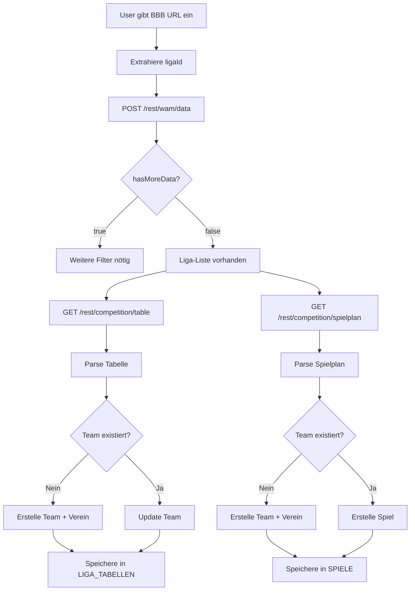

# DBB API - Datenmodell-Evaluierung für PWA

**Datum:** 14. Oktober 2025  
**Version:** 1.0

---

## 🎯 Zusammenfassung

Die DBB REST API liefert **alle notwendigen Daten** für unsere Basketball PWA. Das Datenmodell ist konsistent und gut strukturiert. Einige Erweiterungen sind nötig, aber das Grundkonzept passt perfekt.

---

## ✅ Perfekt gemappt

### 1. Liga-Informationen

| DBB API | PWA Datenbank | Status | Mapping |
|---------|---------------|---------|---------|
| `ligaId` | `LIGEN.liga_id` | ✅ Perfect | 1:1 |
| `liganame` | `LIGEN.liga_name` | ✅ Perfect | 1:1 |
| `saison` | `LIGEN.saison` | ✅ Perfect | 1:1 |
| `verbandName` | `LIGEN.verband` | ✅ Perfect | 1:1 |
| `bezirkName` | `LIGEN.region` | ✅ Perfect | 1:1 |
| `akName` | `LIGEN.altersklasse` | ✅ Perfect | 1:1 |
| `skName` | `LIGEN.spielklasse` | ✅ Perfect | 1:1 |
| `geschlecht` | `LIGEN.geschlecht` | ✅ Perfect | 1:1 |

**Code-Beispiel:**
```typescript
// DBB API Response → PWA Database
const liga: Liga = {
  liga_id: dbResponse.ligaId.toString(),
  liga_name: dbResponse.liganame,
  saison: dbResponse.saison,
  verband: dbResponse.verbandName,
  region: dbResponse.bezirkName,
  altersklasse: dbResponse.akName,
  spielklasse: dbResponse.skName,
  geschlecht: dbResponse.geschlecht
};
```

---

### 2. Team-Informationen

| DBB API | PWA Datenbank | Status | Mapping |
|---------|---------------|---------|---------|
| `teamId` | `TEAMS.extern_team_id` | ✅ Perfect | String-Cast |
| `teamName` | `TEAMS.name` | ✅ Perfect | 1:1 |
| `clubId` | `VEREINE.extern_verein_id` | ✅ Perfect | String-Cast |
| `clubName` | `VEREINE.name` | ✅ Perfect | 1:1 |

**Wichtig:** `team_typ` muss beim Import gesetzt werden!

**Code-Beispiel:**
```typescript
// DBB API Response → PWA Database
const team: Team = {
  team_id: generateUUID(),
  extern_team_id: dbResponse.teamId.toString(), // ⭐ NEU
  name: dbResponse.teamName,
  verein_id: vereinId,
  team_typ: 'gegner', // ⭐ NEU: Unterscheidung eigen/gegner
  altersklasse: liga.altersklasse,
  saison: liga.saison
};
```

---

### 3. Tabellen-Daten

| DBB API | PWA Datenbank | Status | Mapping |
|---------|---------------|---------|---------|
| `position` | `LIGA_TABELLEN.rang` | ✅ Perfect | 1:1 |
| `teamId` | `LIGA_TABELLEN.team_id` | ✅ Perfect | Lookup via extern_team_id |
| `games` | `LIGA_TABELLEN.spiele` | ✅ Perfect | 1:1 |
| `wins` | `LIGA_TABELLEN.siege` | ✅ Perfect | 1:1 |
| `losses` | `LIGA_TABELLEN.niederlagen` | ✅ Perfect | 1:1 |
| `points` | `LIGA_TABELLEN.punkte` | ✅ Perfect | 1:1 |
| `scoredPoints` | `LIGA_TABELLEN.koerbe_plus` | ✅ Perfect | 1:1 |
| `concededPoints` | `LIGA_TABELLEN.koerbe_minus` | ✅ Perfect | 1:1 |
| `pointsDifference` | `LIGA_TABELLEN.diff` | ✅ Perfect | 1:1 |

**Code-Beispiel:**
```typescript
// DBB API Response → PWA Database
const tabellenEintrag: LigaTabelle = {
  tabellen_id: generateUUID(),
  liga_id: ligaId,
  team_id: lookupTeamByExternId(dbResponse.teamId),
  rang: dbResponse.position,
  spiele: dbResponse.games,
  siege: dbResponse.wins,
  niederlagen: dbResponse.losses,
  punkte: dbResponse.points,
  koerbe_plus: dbResponse.scoredPoints,
  koerbe_minus: dbResponse.concededPoints,
  diff: dbResponse.pointsDifference,
  datum: new Date()
};
```

---

### 4. Spielplan-Daten

| DBB API | PWA Datenbank | Status | Mapping |
|---------|---------------|---------|---------|
| `matchId` | `SPIELE.extern_spiel_id` | ⭐ NEU | String-Cast |
| `gameNumber` | `SPIELE.spielnr` | ✅ Perfect | 1:1 |
| `gameDay` | `SPIELE.spieltag` | ✅ Perfect | 1:1 |
| `date` | `SPIELE.datum` | ✅ Perfect | Parse Date |
| `time` | `SPIELE.uhrzeit` | ✅ Perfect | 1:1 |
| `homeTeam.teamId` | `SPIELE.heim_team_id` | ✅ Perfect | Lookup |
| `awayTeam.teamId` | `SPIELE.gast_team_id` | ✅ Perfect | Lookup |
| `homeScore` | `SPIELE.heim_score` | ✅ Perfect | 1:1 |
| `awayScore` | `SPIELE.gast_score` | ✅ Perfect | 1:1 |
| `status` | `SPIELE.status` | ✅ Perfect | Map Status |
| `venue.name` | `HALLEN.name` (Lookup) | ✅ Perfect | Lookup/Create |

**Status-Mapping:**
```typescript
const statusMap = {
  'scheduled': 'geplant',
  'finished': 'beendet',
  'cancelled': 'abgesagt'
};
```

**Code-Beispiel:**
```typescript
// DBB API Response → PWA Database
const spiel: Spiel = {
  spiel_id: generateUUID(),
  extern_spiel_id: dbResponse.matchId.toString(), // ⭐ NEU
  liga_id: ligaId,
  spielnr: dbResponse.gameNumber,
  spieltag: dbResponse.gameDay,
  datum: new Date(dbResponse.date),
  uhrzeit: dbResponse.time,
  heim_team_id: lookupTeamByExternId(dbResponse.homeTeam.teamId),
  gast_team_id: lookupTeamByExternId(dbResponse.awayTeam.teamId),
  heim_score: dbResponse.homeScore,
  gast_score: dbResponse.awayScore,
  status: mapStatus(dbResponse.status),
  halle_id: lookupOrCreateHalle(dbResponse.venue)
};
```

---

## 🔧 Benötigte Anpassungen

### 1. Neue Felder in bestehenden Tabellen

#### TEAMS
```typescript
interface Team {
  // ... bestehende Felder
  
  // ⭐ NEU: Für DBB-Integration
  extern_team_id?: string;      // teamId aus DBB API
  team_typ: 'eigen' | 'gegner'; // Unterscheidung
}
```

#### VEREINE
```typescript
interface Verein {
  // ... bestehende Felder
  
  // ⭐ NEU: Für DBB-Integration
  extern_verein_id?: string; // clubId aus DBB API
}
```

#### SPIELE
```typescript
interface Spiel {
  // ... bestehende Felder
  
  // ⭐ NEU: Für DBB-Integration
  extern_spiel_id?: string; // matchId aus DBB API
}
```

#### SPIELER
```typescript
interface Spieler {
  // ... bestehende Felder
  
  // ⭐ NEU: Team-Zuordnung (WICHTIG!)
  team_id: string; // 1:n Beziehung zu TEAMS
  
  // ⭐ Für DBB-Integration
  extern_spieler_id?: string; // playerId aus DBB API (falls vorhanden)
}
```

---

### 2. Neue Tabelle: USER (Trainer)

```typescript
interface User {
  user_id: string;
  name: string;
  email?: string;
  created_at: Date;
}
```

**Begründung:**
- Basis für Filterung (nur eigene Teams)
- Zuordnung von eigenen vs. Gegner-Teams
- Später: Multi-User-Support

---

## 📊 Datenfluss: DBB API → PWA

### Import-Workflow



---

## 🎯 Service-Architektur

### 1. BBBApiService (NEU)

```typescript
class BBBApiService {
  private readonly BASE_URL = 'https://www.basketball-bund.net';
  
  /**
   * Sucht Liga via Filter
   */
  async findLiga(filter: WamFilter): Promise<LigaListeEintrag[]> {
    const response = await fetch(`${this.BASE_URL}/rest/wam/data`, {
      method: 'POST',
      headers: { 'Content-Type': 'application/json' },
      body: JSON.stringify(filter)
    });
    
    const data = await response.json();
    
    if (data.data.ligaListe.hasMoreData) {
      throw new Error('Weitere Filterung erforderlich');
    }
    
    return data.data.ligaListe.ligen;
  }
  
  /**
   * Holt Tabelle
   */
  async getTabelle(ligaId: number): Promise<TabellenEintrag[]> {
    const response = await fetch(
      `${this.BASE_URL}/rest/competition/table/id/${ligaId}`
    );
    return await response.json();
  }
  
  /**
   * Holt Spielplan
   */
  async getSpielplan(ligaId: number): Promise<SpielBasic[]> {
    const response = await fetch(
      `${this.BASE_URL}/rest/competition/spielplan/id/${ligaId}`
    );
    return await response.json();
  }
  
  /**
   * Holt Match-Info
   */
  async getMatchInfo(matchId: number): Promise<MatchInfoResponse> {
    const response = await fetch(
      `${this.BASE_URL}/rest/match/id/${matchId}/matchInfo`
    );
    return await response.json();
  }
}
```

---

### 2. BBBSyncService (NEU)

```typescript
class BBBSyncService {
  constructor(
    private apiService: BBBApiService,
    private teamService: TeamService,
    private spielService: SpielService,
    private tabelleService: TabelleService
  ) {}
  
  /**
   * Synchronisiert komplette Liga
   */
  async syncLiga(ligaId: number): Promise<void> {
    // 1. Tabelle laden
    const tabelle = await this.apiService.getTabelle(ligaId);
    
    // 2. Teams erstellen/updaten
    for (const eintrag of tabelle) {
      await this.syncTeam(eintrag);
      await this.syncTabellenEintrag(eintrag, ligaId);
    }
    
    // 3. Spielplan laden
    const spielplan = await this.apiService.getSpielplan(ligaId);
    
    // 4. Spiele erstellen/updaten
    for (const spiel of spielplan) {
      await this.syncSpiel(spiel, ligaId);
    }
  }
  
  /**
   * Synchronisiert ein Team
   */
  private async syncTeam(eintrag: TabellenEintrag): Promise<string> {
    // Lookup: Existiert Team bereits?
    let team = await this.teamService.findByExternId(
      eintrag.teamId.toString()
    );
    
    if (!team) {
      // Erstelle Verein
      const vereinId = await this.syncVerein({
        clubId: eintrag.clubId,
        clubName: eintrag.clubName
      });
      
      // Erstelle Team
      team = await this.teamService.createTeam({
        extern_team_id: eintrag.teamId.toString(),
        name: eintrag.teamName,
        verein_id: vereinId,
        team_typ: 'gegner', // Default: gegner
        altersklasse: 'U10', // Aus Liga-Info
        saison: '2025/26'
      });
    }
    
    return team.team_id;
  }
  
  /**
   * Markiert ein Team als "eigen"
   */
  async markAsOwnTeam(teamId: string, userId: string): Promise<void> {
    await this.teamService.updateTeam(teamId, {
      team_typ: 'eigen',
      user_id: userId
    });
  }
}
```

---

### 3. Integration in Onboarding

```typescript
// Step: BBB-URL-Import
async function handleBBBImport(url: string, userId: string) {
  // 1. Extrahiere ligaId
  const ligaId = bbbParserService.extractLigaId(url);
  
  // 2. Sync Liga (alle Teams + Spiele)
  await bbbSyncService.syncLiga(ligaId);
  
  // 3. Zeige Team-Auswahl
  const teams = await teamService.getTeamsByLiga(ligaId);
  
  // User wählt sein Team aus
  const selectedTeamId = await showTeamSelection(teams);
  
  // 4. Markiere als eigenes Team
  await bbbSyncService.markAsOwnTeam(selectedTeamId, userId);
}
```

---

## 🔍 Benchmark-Analysen

### Direkter Vergleich (Kreuztabelle)

```typescript
/**
 * Findet gemeinsame Gegner
 */
async function findCommonOpponents(
  ownTeamId: string,
  nextOpponentId: string
): Promise<BenchmarkResult[]> {
  // 1. Hole Kreuztabelle
  const crosstable = await bbbApiService.getCrosstable(ligaId);
  
  // 2. Finde gemeinsame Gegner
  const commonOpponents = findCommonOpponentsInCrosstable(
    crosstable,
    ownTeamId,
    nextOpponentId
  );
  
  // 3. Berechne Benchmark
  return commonOpponents.map(opponent => ({
    opponentName: opponent.name,
    ownResult: opponent.ownTeamResult, // z.B. 52:35
    nextOpponentResult: opponent.nextOpponentResult, // z.B. 45:38
    analysis: analyzeResults(opponent)
  }));
}
```

---

## ✅ Vollständigkeit-Check

### Verfügbare Daten aus DBB API

| Feature | Daten verfügbar | Status | Notizen |
|---------|----------------|--------|---------|
| **Liga-Suche** | ✅ | Perfect | Filter-basiert |
| **Tabelle** | ✅ | Perfect | Alle Teams, vollständige Stats |
| **Spielplan** | ✅ | Perfect | Alle Spiele (auch ohne eigene Beteiligung) |
| **Ergebnisse** | ✅ | Perfect | Score heim/gast |
| **Kreuztabelle** | ✅ | Perfect | Für Benchmark-Analysen |
| **Match-Info** | ✅ | Perfect | Teams, Spieler, Trainer, Schiedsrichter |
| **Spieler-Liste** | ✅ | Perfect | Name, Trikotnummer, TNA (3 Stellen) |
| **Viertel-Scores** | ✅ | Perfect | Ergebnis nach Vierteln/Achteln |
| **Fouls** | ✅ | Perfect | Team + Persönlich |
| **Team-Stats** | ⚠️ | Partial | Nur höhere Ligen (Regionalliga+) |
| **Spieler-Stats** | ⚠️ | Partial | Nur höhere Ligen (Regionalliga+) |
| **Boxscore** | ⚠️ | Partial | Nur höhere Ligen (Regionalliga+) |

---

## 🚀 Implementierungs-Plan

### Phase 1: Basis-Integration (JETZT)

**Ziel:** Vollständige Liga-Daten in PWA

1. ✅ **USER-Tabelle** erstellen
2. ✅ **Externe IDs** in bestehende Tabellen (TEAMS, VEREINE, SPIELE)
3. ✅ **team_typ** Feld in TEAMS
4. ✅ **team_id** Feld in SPIELER (1:n Beziehung)
5. ✅ **BBBApiService** implementieren
6. ✅ **BBBSyncService** implementieren
7. ✅ **Onboarding**: Team-Auswahl nach Import

**Resultat:**
- Vollständige Tabelle (alle 7 Teams)
- Vollständiger Spielplan (alle Spiele)
- Eigenes Team markiert
- Gegner-Teams verfügbar für Benchmark

---

### Phase 2: Match-Details (SPÄTER)

**Ziel:** Detaillierte Spiel-Informationen

1. **Spieler-Import** aus Match-Info
2. **Viertel-Scores** speichern (U10: 8 Achtel)
3. **Fouls** tracken
4. **Spielberichtsbogen-Parser** (aus PDF/Foto?)

---

### Phase 3: Analysen (SPÄTER)

**Ziel:** Benchmark & Scouting

1. **Kreuztabellen-Auswertung**
2. **Gemeinsame Gegner-Vergleich**
3. **Trend-Analysen**
4. **Scouting-Notizen** (manuell)

---

## 📋 Checkliste

### Datenbank-Änderungen

- [ ] `USER` Tabelle erstellen
- [ ] `TEAMS.extern_team_id` hinzufügen
- [ ] `TEAMS.team_typ` hinzufügen
- [ ] `TEAMS.user_id` hinzufügen (für eigene Teams)
- [ ] `VEREINE.extern_verein_id` hinzufügen
- [ ] `SPIELE.extern_spiel_id` hinzufügen
- [ ] `SPIELER.team_id` als PFLICHTFELD setzen

### Services

- [ ] `BBBApiService` erstellen
- [ ] `BBBSyncService` erstellen
- [ ] `TeamService.findByExternId()` implementieren
- [ ] `TeamService.markAsOwnTeam()` implementieren

### UI

- [ ] Team-Auswahl nach BBB-Import
- [ ] Filter: Nur eigene Spiele im Spielplan
- [ ] Vollständige Tabelle mit Highlight eigenes Team
- [ ] Benchmark-View für nächsten Gegner

---

## ✅ Fazit

Die DBB API ist **perfekt geeignet** für unsere PWA!

**Vorteile:**
- ✅ Vollständige Liga-Daten
- ✅ Konsistentes Datenmodell
- ✅ Eindeutige IDs für Mapping
- ✅ Alle Spiele verfügbar (nicht nur eigene)
- ✅ Kreuztabelle für Benchmark
- ✅ REST API (kein Scraping nötig!)

**Herausforderungen:**
- ⚠️ CORS (Proxy erforderlich)
- ⚠️ Rate-Limiting (unbekannt)
- ⚠️ Detaillierte Stats nur höhere Ligen

**Empfehlung:**
✅ **Start mit Phase 1** - Basis-Integration implementieren!
