# Onboarding Flow v2.0 - Geführte Filter-Auswahl

**Datum:** 14. Oktober 2025  
**Version:** 2.0 - Keine manuelle URL-Eingabe mehr

---

## 🎯 Flow-Übersicht

```mermaid
flowchart TD
    A[App wird gestartet] --> B{Nutzer vorhanden?}
    
    B -- Nein --> C[Onboarding starten]
    C --> C1[Überblick: Was wird gebraucht & erwartet?]
    C1 --> C2[Nutzer gibt Vor- und Nachnamen ein]
    C2 --> C3[Nutzer wählt Verband]
    C3 --> C4[Nutzer wählt Altersklassen]
    C4 --> D[POST /rest/wam/data: Liste der Gebiete]
    D --> E[Nutzer wählt aktives Gebiet]
    E --> F{Mehr als 10 Ligen?}
    F -- Nein --> G[Ligen abrufen: 1 Request]
    F -- Ja --> G1[POST mehrmals: Max. 10 Ligen pro Request]
    G1 --> G
    G --> H[Für jede Liga: Vereine abrufen]
    H --> I[Nutzer wählt Verein]
    I --> J[Nutzer wählt Team/s]
    J --> K[Tabellen & Spielpläne abrufen und speichern]
    K --> L[Nutzer wählt Team zur Bearbeitung]
    L --> M[Team-Dashboard wird angezeigt]
    
    B -- Ja --> N[Dashboard anzeigen]
```



---

## 📋 Detaillierte Steps

### Step 1: Welcome & Übersicht

**UI:**
```tsx
<WelcomeStep>
  <h1>Willkommen bei Basketball Team Manager</h1>
  
  <p>In wenigen Schritten richten wir deine Teams ein:</p>
  
  <ul>
    <li>✅ Deine Daten (Name)</li>
    <li>✅ Verband & Region wählen</li>
    <li>✅ Deine Teams auswählen</li>
    <li>✅ Liga-Daten automatisch laden</li>
  </ul>
  
  <p>Benötigte Zeit: ~3 Minuten</p>
  
  <Button onClick={nextStep}>Los geht's</Button>
</WelcomeStep>
```

---

### Step 2: Nutzer-Daten

**UI:**
```tsx
<UserStep>
  <h2>Deine Daten</h2>
  
  <Input 
    label="Vorname"
    value={vorname}
    onChange={setVorname}
    required
  />
  
  <Input 
    label="Nachname"
    value={nachname}
    onChange={setNachname}
    required
  />
  
  <Input 
    label="E-Mail (optional)"
    type="email"
    value={email}
    onChange={setEmail}
  />
  
  <Button onClick={createUser}>Weiter</Button>
</UserStep>
```

**Database:**
```typescript
const user: User = {
  user_id: generateUUID(),
  name: `${vorname} ${nachname}`,
  vorname: vorname,
  nachname: nachname,
  email: email || null,
  created_at: new Date()
};

await userService.createUser(user);
```

---

### Step 3: Verband wählen

**API Call:**
```typescript
// POST /rest/wam/data mit leerem Body
const response = await fetch('https://www.basketball-bund.net/rest/wam/data', {
  method: 'POST',
  headers: { 'Content-Type': 'application/json' },
  body: JSON.stringify({})
});

const data = await response.json();
const verbaende = data.data.verbaende;
```

**UI:**
```tsx
<VerbandStep>
  <h2>Wähle deinen Landesverband</h2>
  
  <Select
    label="Landesverband"
    options={verbaende.map(v => ({
      value: v.id,
      label: v.label,
      badge: v.hits > 0 ? `${v.hits} Ligen` : null
    }))}
    onChange={setVerbandId}
  />
  
  {/* Beliebte Auswahl */}
  <QuickSelect>
    <Chip onClick={() => setVerbandId(2)}>Bayern</Chip>
    <Chip onClick={() => setVerbandId(1)}>Baden-Württemberg</Chip>
    <Chip onClick={() => setVerbandId(11)}>NRW</Chip>
  </QuickSelect>
  
  <Button onClick={nextStep} disabled={!verbandId}>
    Weiter
  </Button>
</VerbandStep>
```

**State:**
```typescript
const [verbandId, setVerbandId] = useState<number | null>(null);
```

---

### Step 4: Altersklassen wählen

**API Call:**
```typescript
// POST /rest/wam/data mit Verband-Filter
const response = await fetch('https://www.basketball-bund.net/rest/wam/data', {
  method: 'POST',
  headers: { 'Content-Type': 'application/json' },
  body: JSON.stringify({
    token: 0,
    verbandIds: [verbandId],
    gebietIds: [],
    ligatypIds: [],
    akgGeschlechtIds: [],
    altersklasseIds: [],
    spielklasseIds: [],
    sortBy: 1
  })
});

const data = await response.json();
const altersklassen = data.data.altersklassen;
```

**UI:**
```tsx
<AltersklassenStep>
  <h2>Wähle deine Altersklassen</h2>
  
  <p>Du kannst mehrere Altersklassen auswählen, falls du mehrere Teams trainierst.</p>
  
  <CheckboxGroup
    label="Altersklassen"
    options={altersklassen
      .filter(ak => ak.id >= 8 && ak.id <= 14) // U8-U14
      .map(ak => ({
        value: ak.id,
        label: ak.label,
        badge: `${ak.hits} Ligen`
      }))}
    value={altersklasseIds}
    onChange={setAltersklasseIds}
  />
  
  {/* Quick Select für Minis */}
  <QuickSelect label="Schnellauswahl Minis">
    <Chip onClick={() => setAltersklasseIds([8, 10, 12])}>
      U8 + U10 + U12
    </Chip>
    <Chip onClick={() => setAltersklasseIds([10, 12, 14])}>
      U10 + U12 + U14
    </Chip>
  </QuickSelect>
  
  <Button 
    onClick={nextStep} 
    disabled={altersklasseIds.length === 0}
  >
    Weiter ({altersklasseIds.length} ausgewählt)
  </Button>
</AltersklassenStep>
```

**State:**
```typescript
const [altersklasseIds, setAltersklasseIds] = useState<number[]>([]);
```

---

### Step 5: Gebiet wählen

**API Call:**
```typescript
// POST /rest/wam/data mit Verband + Altersklassen
const response = await fetch('https://www.basketball-bund.net/rest/wam/data', {
  method: 'POST',
  headers: { 'Content-Type': 'application/json' },
  body: JSON.stringify({
    token: 0,
    verbandIds: [verbandId],
    gebietIds: [],
    ligatypIds: [],
    akgGeschlechtIds: [],
    altersklasseIds: altersklasseIds,
    spielklasseIds: [],
    sortBy: 1
  })
});

const data = await response.json();
const gebiete = data.data.gebiete;
```

**UI:**
```tsx
<GebietStep>
  <h2>Wähle dein Gebiet</h2>
  
  <p>In welchem Bezirk/Kreis trainierst du?</p>
  
  <RadioGroup
    label="Gebiet"
    options={gebiete.map(g => ({
      value: g.id,
      label: g.bezirk || g.kreis || 'Landesweit',
      description: g.kreis ? `Kreis: ${g.kreis}` : null,
      badge: `${g.hits} Ligen`
    }))}
    value={gebietId}
    onChange={setGebietId}
  />
  
  <Button onClick={nextStep} disabled={!gebietId}>
    Weiter
  </Button>
</GebietStep>
```

**State:**
```typescript
const [gebietId, setGebietId] = useState<string | null>(null);
```

---

### Step 6: Ligen laden

**Logic:**
```typescript
async function loadLigen() {
  const response = await fetch('https://www.basketball-bund.net/rest/wam/data', {
    method: 'POST',
    headers: { 'Content-Type': 'application/json' },
    body: JSON.stringify({
      token: 0,
      verbandIds: [verbandId],
      gebietIds: [gebietId],
      ligatypIds: [],
      akgGeschlechtIds: [],
      altersklasseIds: altersklasseIds,
      spielklasseIds: [],
      sortBy: 1
    })
  });
  
  const data = await response.json();
  
  if (data.data.ligaListe.hasMoreData) {
    throw new Error('Weitere Filterung erforderlich - sollte nicht passieren!');
  }
  
  const ligen = data.data.ligaListe.ligen;
  
  // Check: Mehr als 10 Ligen?
  if (ligen.length > 10) {
    // Aufteilen in Chunks von 10
    const chunks = chunk(ligen, 10);
    
    for (const ligaChunk of chunks) {
      await loadLigaDetails(ligaChunk);
      await sleep(300); // Rate-Limiting
    }
  } else {
    await loadLigaDetails(ligen);
  }
  
  setLigen(ligen);
}

async function loadLigaDetails(ligen: Liga[]) {
  // Für jede Liga: Vereine laden
  for (const liga of ligen) {
    // Tabelle laden → enthält alle Teams + Vereine
    const tabelle = await bbbApiService.getTabelle(liga.ligaId);
    
    // Teams + Vereine extrahieren
    for (const eintrag of tabelle.teams) {
      // Verein erstellen/finden
      let verein = await findVereinByName(eintrag.clubName);
      if (!verein) {
        verein = await vereinService.createVerein({
          verein_id: generateUUID(),
          extern_verein_id: eintrag.clubId.toString(),
          name: eintrag.clubName,
          // ... weitere Felder
        });
      }
      
      // Team erstellen
      await teamService.createTeam({
        team_id: generateUUID(),
        extern_team_id: eintrag.teamId.toString(),
        name: eintrag.teamName,
        verein_id: verein.verein_id,
        team_typ: 'gegner', // Default: alle sind Gegner
        altersklasse: liga.akName,
        saison: liga.saison || '2025/26'
      });
    }
  }
}
```

**UI:**
```tsx
<LigenLoadingStep>
  <h2>Lade Liga-Daten...</h2>
  
  <Progress value={progress} max={totalLigen} />
  
  <p>
    {currentLiga} / {totalLigen} Ligen geladen
  </p>
  
  <ul>
    {loadedLigen.map(liga => (
      <li key={liga.ligaId}>
        ✅ {liga.liganame} ({liga.teams.length} Teams)
      </li>
    ))}
  </ul>
</LigenLoadingStep>
```

---

### Step 7: Verein wählen

**UI:**
```tsx
<VereinStep>
  <h2>Wähle deinen Verein</h2>
  
  <p>Für welchen Verein trainierst du?</p>
  
  <SearchableSelect
    label="Verein"
    options={vereine.map(v => ({
      value: v.verein_id,
      label: v.name,
      badge: `${v.teams.length} Teams`
    }))}
    value={vereinId}
    onChange={setVereinId}
    searchPlaceholder="Verein suchen..."
  />
  
  {/* Schnellauswahl wenn nur wenige Vereine */}
  {vereine.length <= 5 && (
    <QuickSelect>
      {vereine.map(v => (
        <Chip 
          key={v.verein_id}
          onClick={() => setVereinId(v.verein_id)}
        >
          {v.name}
        </Chip>
      ))}
    </QuickSelect>
  )}
  
  <Button onClick={nextStep} disabled={!vereinId}>
    Weiter
  </Button>
</VereinStep>
```

---

### Step 8: Teams wählen (Multi-Select!)

**UI:**
```tsx
<TeamStep>
  <h2>Wähle deine Teams</h2>
  
  <p>Du kannst mehrere Teams auswählen, falls du mehrere Teams trainierst.</p>
  
  <CheckboxGroup
    options={teams
      .filter(t => t.verein_id === vereinId)
      .map(t => ({
        value: t.team_id,
        label: t.name,
        description: `${t.altersklasse} · ${t.liga?.liga_name || 'Keine Liga'}`,
        badge: t.liga?.geschlecht
      }))}
    value={selectedTeamIds}
    onChange={setSelectedTeamIds}
  />
  
  <Alert variant="info">
    💡 Du kannst später weitere Teams hinzufügen oder entfernen
  </Alert>
  
  <Button 
    onClick={nextStep} 
    disabled={selectedTeamIds.length === 0}
  >
    Weiter ({selectedTeamIds.length} ausgewählt)
  </Button>
</TeamStep>
```

**State:**
```typescript
const [selectedTeamIds, setSelectedTeamIds] = useState<string[]>([]);
```

**Logic:**
```typescript
async function markTeamsAsOwn() {
  for (const teamId of selectedTeamIds) {
    await teamService.updateTeam(teamId, {
      team_typ: 'eigen',
      user_id: user.user_id
    });
  }
}
```

---

### Step 9: Daten synchronisieren

**Logic:**
```typescript
async function syncAllData() {
  // Für jedes ausgewählte Team
  for (const teamId of selectedTeamIds) {
    const team = await teamService.getTeam(teamId);
    const liga = await teamService.getLiga(team);
    
    // 1. Tabelle synchronisieren
    await bbbSyncService.syncTabelle(liga.liga_id);
    
    // 2. Spielplan synchronisieren
    await bbbSyncService.syncSpielplan(liga.liga_id);
    
    // 3. Kreuztabelle (optional)
    await bbbSyncService.syncCrosstable(liga.liga_id);
    
    await sleep(300); // Rate-Limiting
  }
}
```

**UI:**
```tsx
<SyncStep>
  <h2>Synchronisiere Daten...</h2>
  
  <Progress value={syncedTeams} max={selectedTeamIds.length} />
  
  <ul>
    {syncProgress.map(item => (
      <li key={item.teamId}>
        {item.status === 'done' && '✅'}
        {item.status === 'loading' && '⏳'}
        {item.status === 'pending' && '⏸️'}
        {' '}
        {item.teamName}
        {item.status === 'done' && (
          <span className="text-sm text-gray-500">
            {' '}({item.games} Spiele, {item.teams} Teams)
          </span>
        )}
      </li>
    ))}
  </ul>
</SyncStep>
```

---

### Step 10: Team zur Bearbeitung wählen

**UI:**
```tsx
<TeamSelectionStep>
  <h2>Wähle ein Team zum Bearbeiten</h2>
  
  <p>Du hast {selectedTeamIds.length} Teams eingerichtet. Welches möchtest du jetzt bearbeiten?</p>
  
  <RadioGroup
    options={myTeams.map(t => ({
      value: t.team_id,
      label: t.name,
      description: `${t.altersklasse} · ${t.spieler?.length || 0} Spieler`,
      icon: <BasketballIcon />
    }))}
    value={activeTeamId}
    onChange={setActiveTeamId}
  />
  
  <Alert variant="info">
    💡 Du kannst jederzeit zwischen deinen Teams wechseln
  </Alert>
  
  <Button onClick={gotoDashboard}>
    Zum Dashboard
  </Button>
</TeamSelectionStep>
```

**State:**
```typescript
// Global App State
const [activeTeamId, setActiveTeamId] = useState<string | null>(null);

// Speichern in Store
appStore.setActiveTeam(activeTeamId);
```

---

## 💾 State Management

### OnboardingStore

```typescript
interface OnboardingState {
  // Current Step
  currentStep: number;
  totalSteps: number;
  
  // User Data
  userId: string | null;
  vorname: string;
  nachname: string;
  email: string | null;
  
  // Filter Selection
  verbandId: number | null;
  altersklasseIds: number[];
  gebietId: string | null;
  
  // Ligen & Teams
  ligen: Liga[];
  vereine: Verein[];
  teams: Team[];
  selectedTeamIds: string[];
  
  // Progress
  isLoading: boolean;
  loadingMessage: string;
  progress: number;
  
  // Actions
  setStep: (step: number) => void;
  setUserData: (data: UserData) => void;
  setFilter: (filter: FilterData) => void;
  setSelectedTeams: (teamIds: string[]) => void;
  
  // Async Actions
  loadGebiete: () => Promise<void>;
  loadLigen: () => Promise<void>;
  syncData: () => Promise<void>;
  complete: () => Promise<void>;
}
```

---

## 🎨 UI-Komponenten

### Progress Indicator

```tsx
<ProgressIndicator>
  <Step completed active>1. Willkommen</Step>
  <Step completed>2. Deine Daten</Step>
  <Step active>3. Verband</Step>
  <Step>4. Altersklassen</Step>
  <Step>5. Gebiet</Step>
  <Step>6. Teams</Step>
  <Step>7. Fertig</Step>
</ProgressIndicator>
```

---

## 🔄 API-Calls Übersicht

| Step | Endpoint | Body | Zweck |
|------|----------|------|-------|
| 3 | POST /rest/wam/data | `{}` | Alle Verbände |
| 4 | POST /rest/wam/data | `{verbandIds}` | Altersklassen |
| 5 | POST /rest/wam/data | `{verbandIds, altersklasseIds}` | Gebiete |
| 6 | POST /rest/wam/data | `{verbandIds, altersklasseIds, gebietIds}` | Ligen |
| 6 | GET /rest/competition/table/id/{ligaId} | - | Teams + Vereine |
| 9 | GET /rest/competition/spielplan/id/{ligaId} | - | Spielplan |
| 9 | GET /rest/competition/crosstable/id/{ligaId} | - | Kreuztabelle |

**Total:** ~3-15 API-Calls je nach Anzahl Ligen

---

## ⚡ Performance-Optimierung

### Rate-Limiting

```typescript
async function batchApiCalls<T>(
  items: any[],
  callFn: (item: any) => Promise<T>,
  batchSize: number = 10,
  delayMs: number = 300
): Promise<T[]> {
  const results: T[] = [];
  const chunks = chunk(items, batchSize);
  
  for (const chunk of chunks) {
    const chunkResults = await Promise.all(
      chunk.map(item => callFn(item))
    );
    results.push(...chunkResults);
    
    // Delay between batches
    if (chunks.indexOf(chunk) < chunks.length - 1) {
      await sleep(delayMs);
    }
  }
  
  return results;
}
```

### Caching

```typescript
// Cache Filter-Optionen
const CACHE_KEY_VERBAENDE = 'onboarding:verbaende';
const CACHE_TTL = 24 * 60 * 60 * 1000; // 24 Stunden

async function getCachedVerbaende(): Promise<Verband[]> {
  const cached = localStorage.getItem(CACHE_KEY_VERBAENDE);
  
  if (cached) {
    const data = JSON.parse(cached);
    if (Date.now() - data.timestamp < CACHE_TTL) {
      return data.verbaende;
    }
  }
  
  // Fetch fresh
  const verbaende = await fetchVerbaende();
  
  localStorage.setItem(CACHE_KEY_VERBAENDE, JSON.stringify({
    verbaende,
    timestamp: Date.now()
  }));
  
  return verbaende;
}
```

---

## ✅ Vorteile des neuen Flows

1. **Benutzerfreundlich**
   - Geführter Prozess (Wizard-Style)
   - Keine manuelle URL-Eingabe
   - Klare Schritte

2. **Robust**
   - Nutzt offizielle API
   - Keine HTML-Parsing-Fehler
   - Validierte Daten

3. **Flexibel**
   - Multi-Team-Support
   - Verschiedene Altersklassen
   - Verschiedene Vereine

4. **Performant**
   - Batch-Processing
   - Rate-Limiting
   - Caching

5. **Vollständig**
   - Alle Teams der Liga
   - Alle Spiele
   - Kreuztabelle

---

## 📋 Implementierungs-Checkliste

### Datenbank (✅ Bereits geplant)

- [ ] USER-Tabelle erstellen
- [ ] TEAMS.extern_team_id
- [ ] TEAMS.team_typ
- [ ] TEAMS.user_id
- [ ] VEREINE.extern_verein_id
- [ ] SPIELE.extern_spiel_id
- [ ] SPIELER.team_id (Pflicht)

### Services

- [ ] UserService erstellen
- [ ] BBBApiService erstellen
- [ ] BBBSyncService erstellen
- [ ] TeamService.markAsOwn()
- [ ] FilterService (Helper für WAM-Data)

### UI-Komponenten

- [ ] WelcomeStep
- [ ] UserStep
- [ ] VerbandStep
- [ ] AltersklassenStep
- [ ] GebietStep
- [ ] LigenLoadingStep
- [ ] VereinStep
- [ ] TeamStep
- [ ] SyncStep
- [ ] TeamSelectionStep
- [ ] ProgressIndicator

### State Management

- [ ] OnboardingStore (Zustand)
- [ ] User-State in AppStore
- [ ] Active-Team in AppStore

---

## 🚀 Nächste Schritte

1. **Review dieses Dokuments** ✋
2. **Feedback** zu Flow und UI
3. **Start Implementierung** Phase 1

**Fragen:**
- Passt der Flow so?
- Sind die UI-Komponenten ok?
- Soll ich mit der Implementierung starten?
