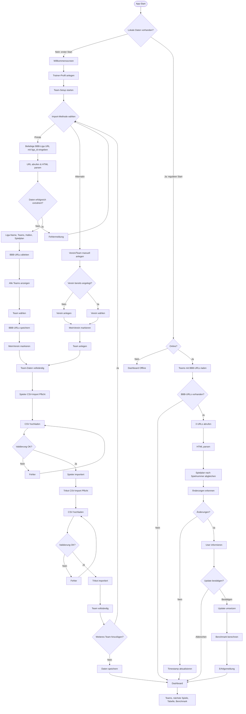

# Basketball PWA - App-Start Flows

## Kompletter Start Flow

```mermaid
flowchart TD
Start([App-Start]) --> CheckData{Lokale Daten vorhanden?}
CheckData -->|Nein: erster Start| Welcome[Willkommensscreen]
Welcome --> TrainerProfile[Trainer-Profil anlegen]
TrainerProfile --> TeamSetup[Team-Setup starten]
TeamSetup --> ImportChoice{Import-Methode wählen}
ImportChoice -->|Primär| URLInput[Beliebige BBB-Liga URL mit liga_id eingeben]
ImportChoice -->|Alternativ| ManualCreate[Verein/Team manuell anlegen]
URLInput --> FetchData[URL abrufen & HTML parsen]
FetchData --> ParseSuccess{Daten erfolgreich extrahiert?}
ParseSuccess -->|Nein| ErrorMsg[Fehlermeldung]
ErrorMsg --> ImportChoice
ParseSuccess -->|Ja| ExtractData[Liga-Name, Teams, Hallen, Spielplan]
ExtractData --> DeriveBBBUrls[BBB-URLs ableiten]
DeriveBBBUrls --> ShowTeams[Alle Teams anzeigen]
ShowTeams --> SelectTeam[Team wählen]
SelectTeam --> StoreURL[BBB-URLs speichern]
StoreURL --> MarkClub[MeinVerein markieren]
MarkClub --> TeamDataComplete[Team-Daten vollständig]
ManualCreate --> CheckClub{Verein bereits angelegt?}
CheckClub -->|Nein| CreateClub[Verein anlegen]
CheckClub -->|Ja| SelectClub[Verein wählen]
CreateClub --> MarkOwnClub[MeinVerein markieren]
SelectClub --> MarkOwnClub
MarkOwnClub --> CreateTeam[Team anlegen]
CreateTeam --> TeamDataComplete
TeamDataComplete --> PlayerImport[Spieler CSV-Import Pflicht]
PlayerImport --> UploadPlayerCSV[CSV hochladen]
UploadPlayerCSV --> PlayerValid{Validierung OK?}
PlayerValid -->|Nein| PlayerError[Fehler]
PlayerError --> UploadPlayerCSV
PlayerValid -->|Ja| PlayerImported[Spieler importiert]
PlayerImported --> JerseyImport[Trikot CSV-Import Pflicht]
JerseyImport --> UploadJerseyCSV[CSV hochladen]
UploadJerseyCSV --> JerseyValid{Validierung OK?}
JerseyValid -->|Nein| JerseyError[Fehler]
JerseyError --> UploadJerseyCSV
JerseyValid -->|Ja| JerseyImported[Trikot importiert]
JerseyImported --> TeamComplete[Team vollständig]
TeamComplete --> AddMoreTeams{Weiteres Team hinzufügen?}
AddMoreTeams -->|Ja| ImportChoice
AddMoreTeams -->|Nein| SaveAllData[Daten speichern]
SaveAllData --> Dashboard
CheckData -->|Ja: regulärer Start| CheckOnline{Online?}
CheckOnline -->|Nein| DashboardOffline[Dashboard Offline]
CheckOnline -->|Ja| LoadTeams[Teams mit BBB-URLs laden]
LoadTeams --> HasURLs{BBB-URLs vorhanden?}
HasURLs -->|Nein| Dashboard
HasURLs -->|Ja| FetchThreeUrls[3 URLs abrufen]
FetchThreeUrls --> ParseAllData[HTML parsen]
ParseAllData --> MatchByNr[Spielplan nach Spielnummer abgleichen]
MatchByNr --> CompareData[Änderungen erkennen]
CompareData --> ChangesFound{Änderungen?}
ChangesFound -->|Nein| UpdateTimestamp[Timestamp aktualisieren]
UpdateTimestamp --> Dashboard
ChangesFound -->|Ja| ShowChanges[User informieren]
ShowChanges --> UserConfirm{Update bestätigen?}
UserConfirm -->|Abbrechen| Dashboard
UserConfirm -->|Bestätigen| ApplyUpdates[Update umsetzen]
ApplyUpdates --> CalculateBenchmark[Benchmark berechnen]
CalculateBenchmark --> ShowSuccess[Erfolgsmeldung]
ShowSuccess --> Dashboard
Dashboard --> ShowOverview[Teams, nächste Spiele, Tabelle, Benchmark]
```